# BRabbit Lab : CyberDefenders Writeup

> Reconstruction de la chaîne d'attaque du ransomware Bad Rabbit (octobre 2017) à partir d'un échantillon réel et de sources Threat Intelligence publiques.

| Lab | Catégorie | Difficulté | Statut |
|---|---|---|---|
| [BRabbit](https://cyberdefenders.org/blueteam-ctf-challenges/brabbit) | Threat Intel | Medium | 11/11 ✅ |

**Tactiques MITRE couvertes** : Execution, Persistence, Privilege Escalation, Command and Control, Impact

---

## Contexte

Le lab fournit une archive contenant un email de phishing (`.eml`) accompagné d'une pièce jointe. L'objectif est de reconstituer la chaîne d'infection, d'identifier le malware, son comportement runtime, et de remonter jusqu'à l'acteur derrière la campagne.

L'échantillon est Bad Rabbit, un ransomware ayant frappé l'Ukraine et la Russie en octobre 2017. Particularités notables : modification du MBR pour empêcher le boot, mouvement latéral via SMB avec credentials hardcodés, réutilisation d'un driver légitime pour le chiffrement disque.

## Méthodologie et sources

J'ai volontairement limité mes sources à ce qu'un analyste SOC trouverait en première intention sans outils payants ni reverse engineering :

- [Hybrid Analysis sample 1](https://hybrid-analysis.com/sample/8ebc97e05c8e1073bda2efb6f4d00ad7e789260afa2c276f0c72740b838a0a93/59ef592e7ca3e136870380b3) pour le comportement runtime et les screenshots de la sandbox
- [Hybrid Analysis sample 2](https://hybrid-analysis.com/sample/630325cac09ac3fab908f903e3b00d0dadd5fdaa0875ed8496fcbb97a558d0da/69e09f8601571e030100e330) pour `dispci.exe`
- [MITRE ATT&CK Software S0606](https://attack.mitre.org/software/S0606/) pour l'attribution et le mapping des techniques
- [Kaspersky Securelist](https://securelist.com/bad-rabbit-ransomware/82851/) comme source d'analyse technique de référence
- Les pages MITRE individuelles des sub-techniques pour valider les IDs (recherche directe sur attack.mitre.org)

Pas de VirusTotal, pas d'ANY.RUN dans ce writeup. L'idée était de voir jusqu'où on peut aller en TI pure avec des sources publiques de qualité.

## Setup

```bash
unzip BRabbit.zip       # mot de passe : cyberdefenders.org
cd 218-BRabbit
```

L'archive interne `Urget Contract Action.zip` utilise du chiffrement AES (méthode 99), que `unzip` natif ne gère pas. Solution :

```bash
7z x "Urget Contract Action.zip" -pinfected
```

Le `Warning.txt` fourni est clair : c'est un ransomware réel. Toute analyse dynamique passe par sandbox en ligne, jamais en local sur la machine hôte ou même sur la VM d'analyse non isolée.

### Extraction de la pièce jointe et calcul du hash

Le `.eml` contient une pièce jointe encodée en base64 dans le corps du message. Pour l'extraire proprement sans ouvrir l'email :

```bash
ripmime -i "Urget Contract Action.eml" -d ./attachments/
sha256sum ./attachments/*
```

`ripmime` parse le format MIME et écrit chaque pièce jointe dans `./attachments/`. Le SHA256 obtenu est ensuite injecté dans Hybrid Analysis pour récupérer le rapport existant. Pas besoin d'exécuter quoi que ce soit en local.

---

## Investigation pas à pas

### Q1. Adresse email suspecte de l'expéditeur

L'inspection des headers du `.eml` donne directement l'info. Le champ `From` expose `theceojamessmith@Drurnbo.com`. Le domaine `Drurnbo.com` est typosquatté/jetable, et le tag "CEO" dans l'username est typique du business email compromise (BEC) où l'attaquant se fait passer pour un dirigeant pour créer un sentiment d'urgence.

**Réponse** : `theceojamessmith@Drurnbo.com`

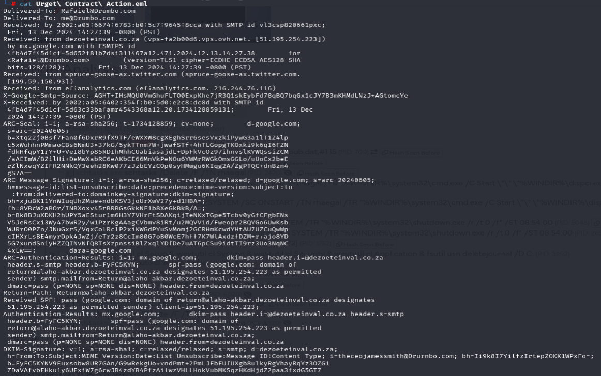
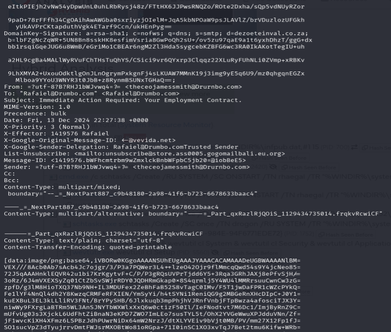

### Q2. Famille de malware

Le SHA256 calculé précédemment, soumis à Hybrid Analysis, retourne immédiatement les tags `badrabbit` et `ransomware`. Confirmation croisée avec la fiche MITRE S0606 où Bad Rabbit est listé comme malware avec ses aliases.

**Réponse** : `BadRabbit`

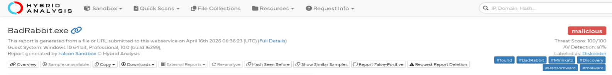

### Q3. Premier fichier droppé

Le rapport Hybrid Analysis (onglet "Hybrid Analysis" du rapport) détaille les opérations runtime du process parent. Premier fichier écrit sur disque : `C:\Windows\infpub.dat`. Cohérent avec la description Kaspersky : `infpub.dat` est la DLL principale du ransomware, exécutée via `rundll32 C:\Windows\infpub.dat,#1`.

**Réponse** : `infpub.dat`

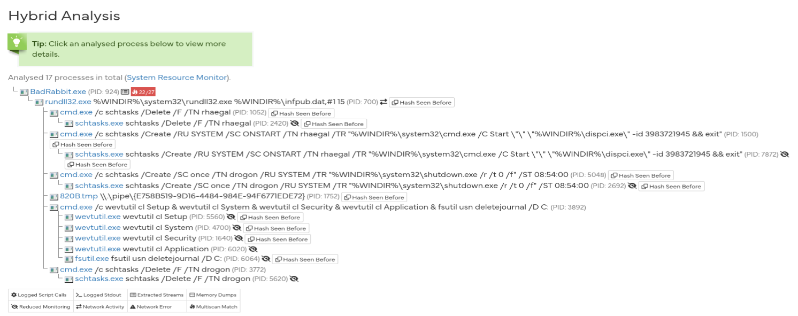

### Q4. Username hardcodé "personnel"

Kaspersky publie la liste complète des credentials hardcodés que Bad Rabbit teste pour son mouvement latéral SMB. La liste contient majoritairement des termes génériques (`Administrator`, `Guest`, `User`, `admin`, `root`, `manager`...). Un seul ressort comme prénom propre : **alex**.

Aucun rapport public ne tranche sur l'origine de ce nom. Hypothèse personnelle : référence interne à l'équipe de développement ou cible identifiée lors d'une opération antérieure. Sandworm a un historique d'amateurisme volontaire sur certains détails (cf. les références Game of Thrones plus bas), donc rien d'impossible.

**Réponse** : `alex`

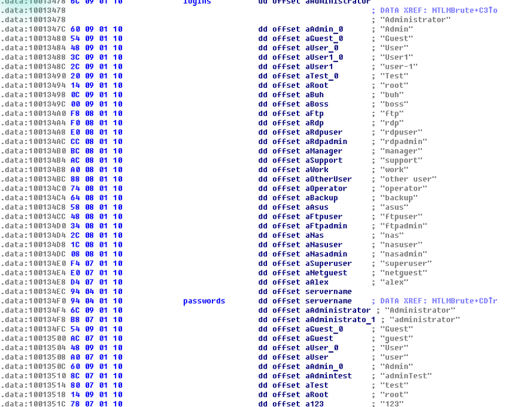

### Q5. Sub-technique C2 via web protocols

Page MITRE S0606, section "Techniques Used". Bad Rabbit communique avec son infrastructure via HTTP. Mapping direct sur `T1071.001 - Application Layer Protocol: Web Protocols`.

**Réponse** : `T1071.001`

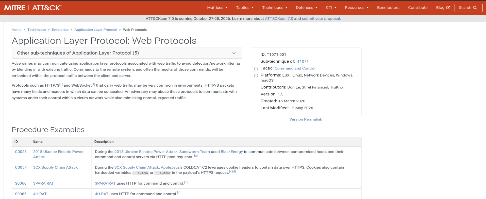

### Q6. Sub-technique de persistance

Bad Rabbit crée des tâches planifiées pour orchestrer son exécution (le reboot programmé est critique pour activer le bootloader malveillant). Sub-technique `T1053.005 - Scheduled Task/Job: Scheduled Task`.

**Réponse** : `T1053.005`

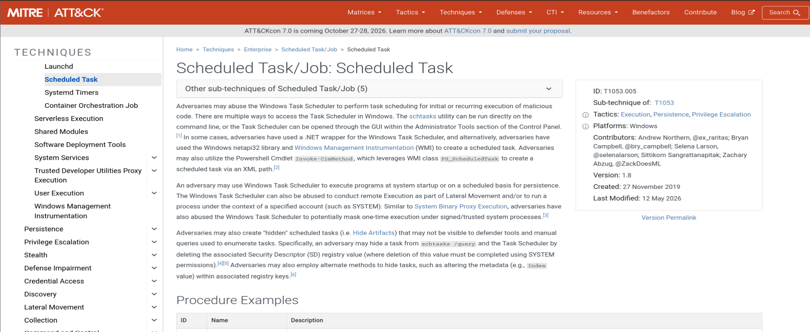

### Q7. Noms des tâches planifiées créées

Visible dans les lignes de commande des process invoqués (`schtasks /Create /TN ...`). Référence directe à Game of Thrones : ce sont les noms des dragons de Daenerys.

- `rhaegal` pour le reboot programmé
- `drogon` pour le shutdown forcé

Petit aparté : c'est exactement le genre de pattern qui aide à l'attribution. Sandworm a déjà signé d'autres opérations avec des références culturelles (Olympic Destroyer, NotPetya). Ça n'est pas une preuve, mais c'est un faisceau.

**Réponse** : `rhaegal, drogon`


### Q8. Message console de dispci.exe

Le binaire `dispci.exe` affiche un message à l'utilisateur lui demandant de désactiver ses protections avant de procéder. Pour cette question, je suis passé par la section **Screenshots** du rapport Hybrid Analysis : la sandbox capture des images de l'écran pendant l'exécution, et l'une d'elles montre la console avec le message affiché en clair.

C'est un bon rappel : pour des messages affichés à l'utilisateur, les captures de la sandbox sont parfois plus pertinentes que les strings extraites du binaire, surtout quand on cherche le message exact tel que vu par la victime.

**Réponse** : `Disable your anti-virus and anti-malware programs`

Côté analyse : le malware demande poliment à la victime de se rendre vulnérable. Ça marche parce qu'il est exécuté par un utilisateur à droits admin qui a déjà cliqué sur un faux installer Flash. À ce stade, la victime est psychologiquement prête à valider l'étape suivante.

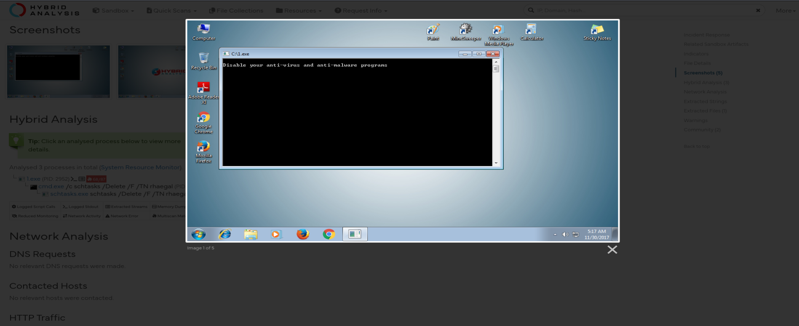

### Q9. Driver utilisé pour MBR et chiffrement disque

Bad Rabbit ne réécrit pas un driver custom. Il réutilise **DiskCryptor**, un outil open source légitime de chiffrement de disque (driver `cscc.sys`). C'est documenté en clair par Kaspersky et confirmé sur MITRE S0606.

La logique derrière le choix : un driver signé numériquement, déjà connu et toléré par les solutions de sécurité, qui dispose nativement des fonctions de bas niveau pour écrire sur le secteur 0 (MBR) et chiffrer un volume entier. Plutôt que de développer et signer son propre driver (coûteux, risqué), l'attaquant détourne un binaire légitime.

C'est la définition même d'une attaque Living-off-the-Land Driver (LOLDriver), un pattern qui reste très actif en 2024-2025 sur d'autres drivers signés Windows.

**Réponse** : `DiskCryptor`

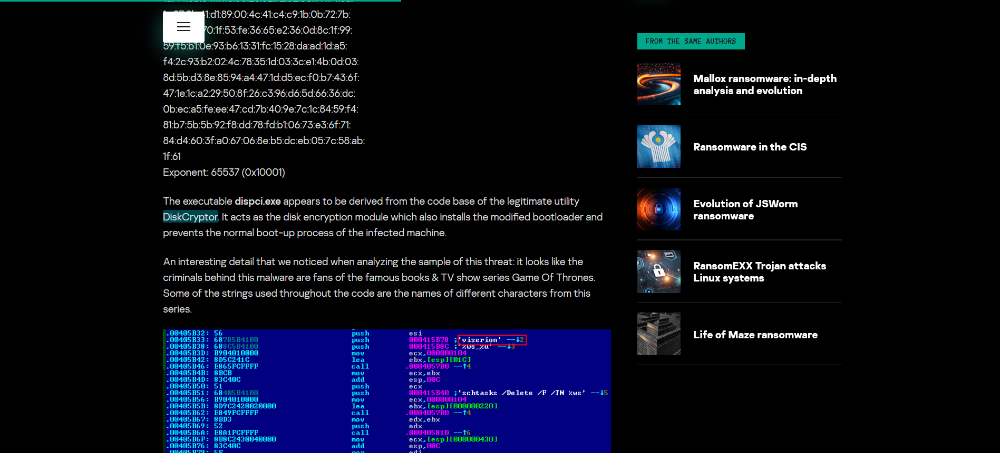

### Q10. Threat actor

Page MITRE S0606, section "Groups That Use This Software" : **Sandworm Team** (G0034). APT lié au GRU russe (Unit 74455), attribué à plusieurs opérations destructives notables : NotPetya (2017), BlackEnergy contre le réseau électrique ukrainien (2015-2016), Industroyer, Olympic Destroyer (2018).

Bad Rabbit s'inscrit dans cette continuité opérationnelle : un "ransomware" dont l'objectif réel n'est pas le rançonnage mais le sabotage. La preuve : la modification du MBR rend la récupération impossible même si la victime paie.

**Réponse** : `Sandworm`

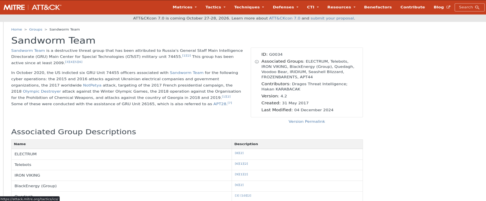

### Q11. Technique de corruption du firmware

La modification du MBR pour empêcher le boot tombe sous `T1495 - Firmware Corruption`. Pas de sub-technique sur celle-ci, l'ID est complet.

**Réponse** : `T1495`

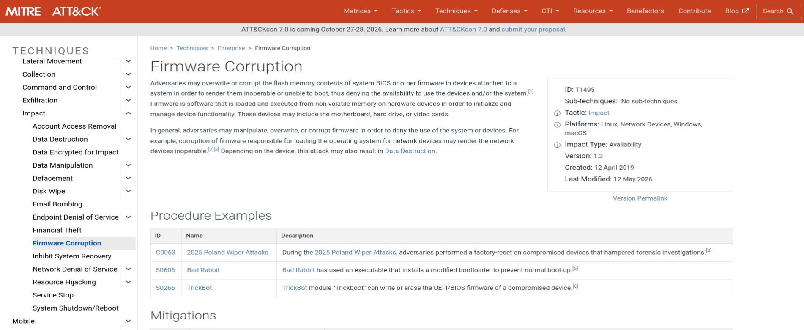

---

## Chaîne d'attaque reconstituée

```
Email phishing (theceojamessmith@Drurnbo.com)
       │
       ▼
.exe exécuté par la victime (faux installer)
       │
       ├──► Drop C:\Windows\infpub.dat (DLL ransomware)
       │       │
       │       └──► rundll32.exe infpub.dat,#1 15
       │              │
       │              ├──► Chiffrement des fichiers (AES)
       │              └──► Tentatives de mouvement latéral SMB
       │                     (credentials hardcodés + Mimikatz)
       │
       └──► Drop dispci.exe
              │
              ├──► Installation du driver DiskCryptor (cscc.sys) en service
              ├──► Création schtasks : rhaegal (reboot) + drogon (shutdown)
              └──► Écrasement du MBR via le driver
                     │
                     ▼
              Reboot programmé
                     │
                     ▼
              Boot impossible. Écran de rançon.
```

## Ce que j'ai retenu

Quelques observations à la fin du lab, plus pour moi que pour qui me lit.

Le scoping des sources change drastiquement la difficulté. Avec seulement Kaspersky, MITRE et Hybrid Analysis, certaines questions sont triviales (Q10 attribution, deux clics sur MITRE) et d'autres demandent une lecture attentive (Q4 alex au milieu des termes génériques). C'est exactement le workflow d'un analyste TI en SOC : pas besoin d'outils payants, juste savoir où chercher et croiser correctement.

Pour Q8, j'avais d'abord cherché dans les strings extraites du binaire avant de réaliser que la section Screenshots de Hybrid Analysis donnait la réponse plus directement. Bon rappel que les sandboxes capturent aussi le visuel runtime, pas que les indicateurs techniques.

Bad Rabbit est un excellent cas d'école pour comprendre le pattern Sandworm. Un malware destructeur déguisé en ransomware, où la composante "rançonnage" est cosmétique. Le vrai but est le sabotage, et la modification du MBR est l'élément qui trahit l'intention : c'est irréversible.

Le détournement de DiskCryptor m'a fait creuser le sujet plus large des LOLDrivers. Les analyses récentes sur les drivers signés vulnérables (loldrivers.io) montrent que la technique est toujours d'actualité, et que la signature numérique d'un driver ne suffit absolument pas à le considérer comme safe.

Côté méthodo, ne pas confondre "username affiché par la sandbox" (`admin` dans Hybrid Analysis = compte Windows de la VM) et "username hardcodé dans le malware". Erreur que j'ai failli faire au début.

## Références

- [MITRE ATT&CK : Bad Rabbit (S0606)](https://attack.mitre.org/software/S0606/)
- [MITRE ATT&CK : Sandworm Team (G0034)](https://attack.mitre.org/groups/G0034/)
- [Kaspersky Securelist : Bad Rabbit Ransomware](https://securelist.com/bad-rabbit-ransomware/82851/)
- [MITRE T1071.001 : Web Protocols](https://attack.mitre.org/techniques/T1071/001/)
- [MITRE T1053.005 : Scheduled Task](https://attack.mitre.org/techniques/T1053/005/)
- [MITRE T1495 : Firmware Corruption](https://attack.mitre.org/techniques/T1495/)
- [Hybrid Analysis : sample 1 (UrgentXContractXAction.pdf.exe)](https://hybrid-analysis.com/sample/8ebc97e05c8e1073bda2efb6f4d00ad7e789260afa2c276f0c72740b838a0a93/59ef592e7ca3e136870380b3)
- [Hybrid Analysis : sample 2 (dispci.exe)](https://hybrid-analysis.com/sample/630325cac09ac3fab908f903e3b00d0dadd5fdaa0875ed8496fcbb97a558d0da/69e09f8601571e030100e330)


