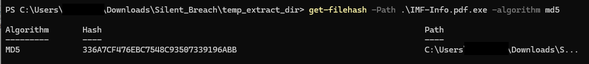
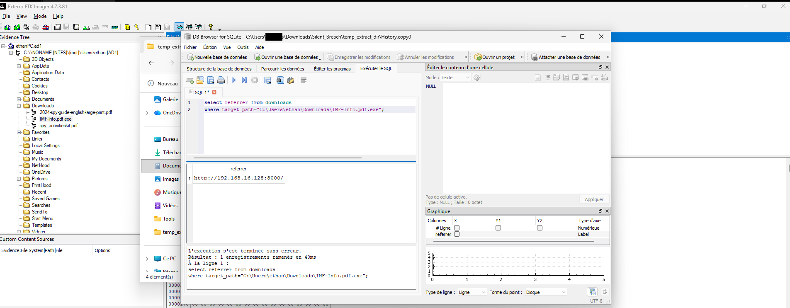
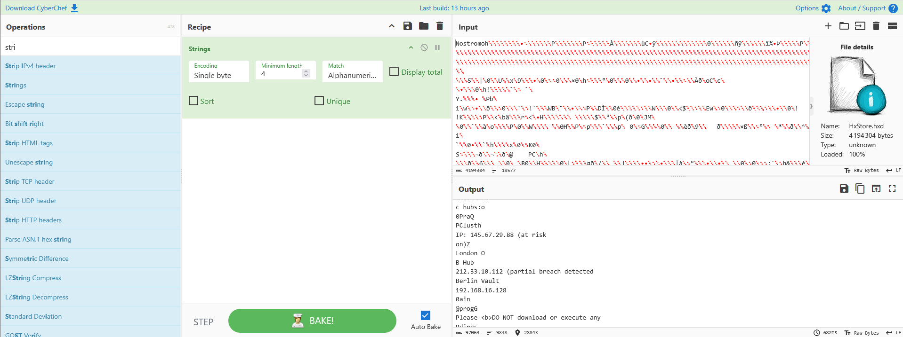
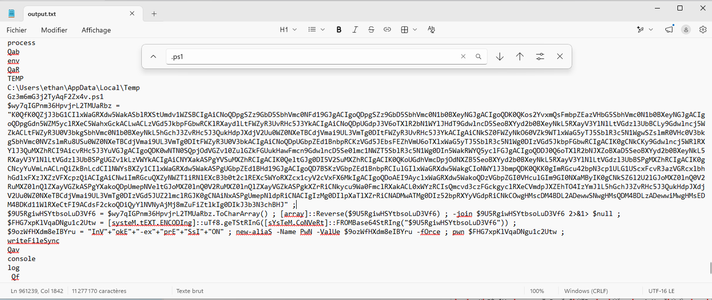
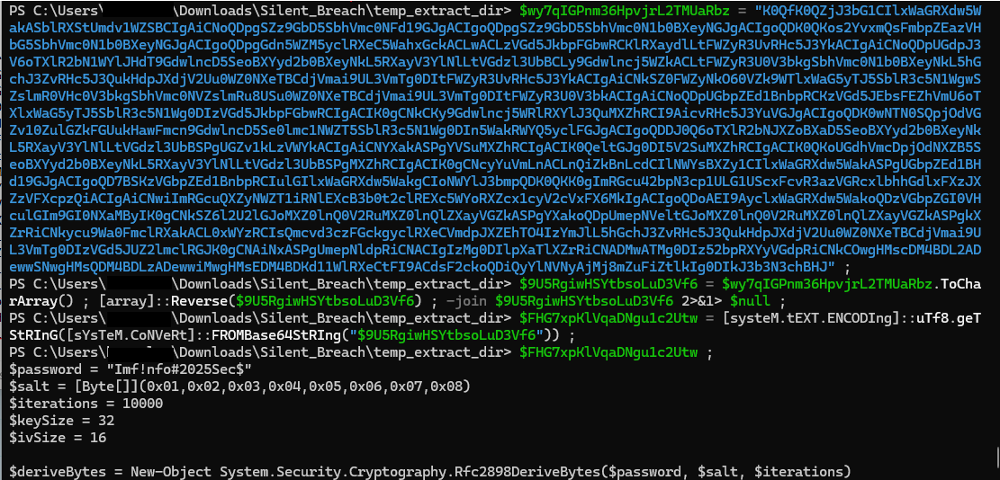
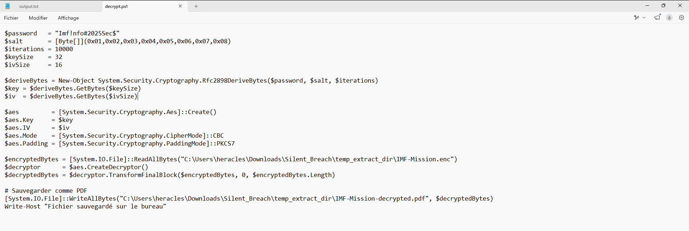
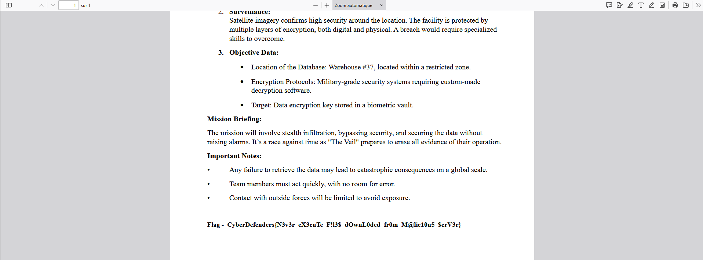

# Silent Breach Lab : CyberDefenders Writeup

> Forensique d'une image disque Windows. Extraction d'artefacts Edge, analyse d'emails via HxStore.hxd, reverse statique d'un binaire Node.js packagé, déchiffrement AES-256 PBKDF2.

| Lab | Catégorie | Difficulté | Statut |
|---|---|---|---|
| [Silent Breach](https://cyberdefenders.org/blueteam-ctf-challenges/silent-breach) | Endpoint Forensics | Medium | 6/6 ✅ |

**Tactiques MITRE couvertes** : Execution, Defense Evasion, Collection

---

## Contexte

Le scénario : l'IMF subit une attaque. Un agent télécharge un fichier depuis un serveur interne compromis, les données deviennent illisibles, et Benji doit reconstituer ce qui s'est passé depuis l'image forensique.

La source est une image AD1 à analyser via FTK Imager. Six questions couvrent la chaîne complète : de l'artefact de téléchargement jusqu'au déchiffrement du document exfiltré. Le lab est retiré, noté 4.6/5 par la communauté, et mérite ce score. La dernière question (déchiffrement AES depuis un binaire obfusqué) demande de comprendre réellement la chaîne au lieu de juste suivre une procédure.

---

## Méthodologie et sources

Ce que j'ai utilisé :

- **FTK Imager** pour monter l'image AD1 et extraire les fichiers
- **DB Browser for SQLite** pour les artefacts Edge (History, downloads)
- **CyberChef** (opération Strings) pour extraire le contenu de HxStore.hxd
- **strings.exe** (Sysinternals) pour extraire les strings du binaire malveillant
- **PowerShell** pour décoder le script embarqué et déchiffrer les fichiers `.enc`

Tout en statique, pas d'exécution du sample.

---

## Investigation pas à pas

### Q1. Hash MD5 du fichier EXE téléchargé

**Outil** : FTK Imager + PowerShell

Une fois l'image montée dans FTK Imager, le répertoire `Downloads` de l'utilisateur `ethan` contient un fichier qui sort du lot : `IMF-Info.pdf.exe`. L'extension double est le premier signal. Le hash MD5 se calcule directement depuis PowerShell après extraction :

```powershell
Get-FileHash "IMF-Info.pdf.exe" -Algorithm MD5
```

**Réponse** : `336A7CF476EBC7548C93507339196ABB`



---

### Q2. URL de téléchargement du fichier

**Outil** : DB Browser for SQLite

L'historique Edge est stocké dans un fichier SQLite à :

```
Users\ethan\AppData\Local\Microsoft\Edge\User Data\Default\History
```

La table `downloads` contient plusieurs colonnes utiles. Attention au piège classique : `referrer` donne la page qui a initié le téléchargement, pas l'URL directe du fichier. L'URL réelle du fichier se trouve dans `tab_url` ou dans la table liée `downloads_url_chains`. Dans ce cas les deux pointent vers la même ressource, un serveur HTTP local sur le port 8000.

**Réponse** : `http://192.168.16.128:8000/IMF-Info.pdf.exe`



---

### Q3. Application utilisée pour le téléchargement

**Outil** : DB Browser for SQLite

Même table `downloads`. La colonne `tab_url` est servie par le processus Edge, et l'artefact est dans le profil Edge de l'utilisateur. La confirmation vient aussi du chemin du fichier History lui-même.

**Réponse** : `microsoft edge`

---

### Q4. Adresses IP mentionnées dans les emails

**Outil** : CyberChef (Strings)

Windows Mail (sous Windows 10+) stocke les messages dans `HxStore.hxd` à :

```
Users\ethan\AppData\Local\Packages\microsoft.windowscommunicationsapps_8wekyb3d8bbwe\LocalState\
```

Le fichier est binaire mais les corps de messages y sont stockés en texte quasi-lisible. J'ai importé le fichier dans CyberChef avec l'opération Strings, ce qui extrait directement les séquences de caractères lisibles sans avoir à parser la structure binaire. En inspectant le résultat, l'email mentionnant les trois IPs apparaît en clair dans le corps d'un message.

**Réponse** : `145.67.29.88, 212.33.10.112, 192.168.16.128`



---

### Q5. Mot de passe utilisé par le script PowerShell embarqué

**Outil** : strings.exe

`IMF-Info.pdf.exe` fait ~34 Mo, ce qui est suspect pour un exécutable. J'ai lancé strings.exe sur le binaire et exporté le résultat dans un fichier texte. Une recherche sur des termes liés à PowerShell (`ps1`, `powershell`, `password`, `AES`) dans le fichier texte amène rapidement à un bloc de code qui sort du lot : un script PowerShell avec un mot de passe en clair, du sel hardcodé, et une configuration AES-256 CBC via PBKDF2.

En cherchant un peu plus, on comprend que le binaire est packagé avec `pkg` (un bundler Node.js qui embarque le runtime et le code source dans un seul exécutable). Une alternative à strings aurait été d'extraire directement `main.js` depuis le bundle, ce qui donne un accès plus propre au code. Dans les deux cas on arrive au même script PS1 encodé en Base64 avec inversion de tableau. Pour le décoder, j'ai simplement exécuté les variables du script dans PowerShell jusqu'à obtenir le texte en clair.

Le mot de passe apparaît en clair dans le script décodé.

**Réponse** : `Imf!nfo#2025Sec$`




---

### Q6. String secrète dans les fichiers déchiffrés

**Outil** : PowerShell

FTK Imager révèle deux fichiers `.enc` dans le répertoire de l'utilisateur : `IMF-Mission.enc` et `IMF-Secret.enc`. Avec la configuration AES extraite à la question précédente (mot de passe, sel, nombre d'itérations, mode CBC, padding PKCS7), j'ai écrit un script PowerShell qui reproduit le déchiffrement et écrit le résultat en `.pdf`. Les deux fichiers décodés s'ouvre normalement et la string secrète est visible dans le document IMF-Mission.

**Réponse** : `CyberDefenders{N3v3r_eX3cuTe_F!l3$_dOwn L0ded_fr0m_M@lic10u5_S0urc3$}`




---

## Chaîne d'attaque reconstituée

```
Serveur attaquant (192.168.16.128:8000)
       │
       │  Email envoyé à ethan (via Windows Mail)
       │  → 3 IPs mentionnées dans le corps du message
       ▼
ethan télécharge IMF-Info.pdf.exe via Microsoft Edge
       │
       ▼
Exécution du binaire (Node.js packagé avec pkg)
       │
       └── main.js embarqué
               │
               ├── Extrait un script PowerShell encodé (Base64 + Array.Reverse)
               │
               └── Script PS1 décodé :
                       AES-256 CBC / PBKDF2
                       $password = "Imf!nfo#2025Sec$"
                       │
                       ├── Chiffre IMF-Mission.enc
                       └── Chiffre IMF-Secret.enc
                                    │
                                    ▼
                           Contenu : flag CyberDefenders
```

---

## Ce que j'ai retenu

La question 5 est la plus instructive du lab, pas à cause de la difficulté technique, mais parce qu'elle demande de comprendre la structure du binaire avant de savoir quoi chercher.

Strings sur un binaire de 34 Mo produit beaucoup de bruit. Le runtime Node.js embarqué représente l'essentiel du volume. La bonne approche : exporter dans un fichier texte et chercher des termes métier (`ps1`, `powershell`, `password`) plutôt que de parcourir le dump ligne par ligne. Le payload utile remonte vite une fois qu'on sait quoi chercher.

Le double encodage du script (Base64 + inversion de tableau) est une obfuscation basique mais elle suffit à faire rater les recherches directes sur `FromBase64`. Sans lire le code qui entoure le blob, on ne voit pas le `Array.Reverse()`. C'est le genre de détail qui fait perdre du temps si on se contente de chercher le blob sans comprendre comment il est décodé.

Pour la Q4, CyberChef avec l'opération Strings sur `HxStore.hxd` est une approche propre. Le fichier est mal documenté et sa structure interne n'est pas publique, mais le contenu des messages y est stocké en texte suffisamment lisible pour qu'une extraction de strings suffise. Pas besoin d'outil dédié.

Pour la Q2, j'avais d'abord soumis la valeur de `referrer` dans la table `downloads` en pensant que c'était l'URL du fichier. `referrer` est la page qui a déclenché le téléchargement, pas la source directe. `tab_url` est la colonne à regarder en premier.

---

## Références

- [CyberDefenders : Silent Breach Lab](https://cyberdefenders.org/blueteam-ctf-challenges/silent-breach)
- [Boncaldo's Forensics Blog : HxStore.hxd Research](https://boncaldo.wordpress.com/2018/12/09/microsoft-hxstore-hxd-email-research/)
- [Sysinternals Strings](https://learn.microsoft.com/en-us/sysinternals/downloads/strings)
- [pkg : Node.js packager](https://github.com/vercel/pkg)
- [PBKDF2 / Rfc2898DeriveBytes (Microsoft Docs)](https://learn.microsoft.com/en-us/dotnet/api/system.security.cryptography.rfc2898derivebytes)
