# Bumblebee : HackTheBox Sherlock Writeup

> Forensic d'un forum phpBB compromis suite au vol des credentials administrateur par un sous-traitant, reconstitution de la chaîne depuis l'injection du credential stealer jusqu'au téléchargement de la base de données.

| Lab | Catégorie | Difficulté | Statut |
|---|---|---|---|
| [Bumblebee](https://app.hackthebox.com/sherlocks/bumblebee) | DFIR | Easy | 10/10 ✅ |

**Tactiques MITRE couvertes** : Credential Access, Privilege Escalation, Collection, Exfiltration

---

## Contexte

Un sous-traitant externe accède au forum interne de Forela depuis le Wi-Fi guest. Il injecte un credential stealer dans un post du forum, attend que l'administrateur se connecte, récupère ses credentials, puis exploite le compte admin pour exfiltrer la base de données complète.

Le lab fournit deux artefacts : un dump SQLite3 du forum phpBB et les logs d'accès Apache. Pas d'artefacts filesystem, pas de mémoire. Tout se joue dans la base de données et les fichiers de logs HTTP.

## Outils utilisés

Deux outils suffisent pour ce challenge :

- **DB Browser for SQLite** pour explorer le dump phpBB (tables phpbb_users, phpbb_posts, phpbb_log, phpbb_sessions, phpbb_config)
- **Bloc Notes** pour naviguer dans les logs Apache avec Ctrl+F

Le challenge est orienté SQL et schéma phpBB. Connaître les noms des tables aide, mais ils sont suffisamment explicites pour progresser sans documentation.

---

## Investigation pas à pas

### Q1. Username du sous-traitant

Premier réflexe : ouvrir le dump dans DB Browser, table `phpbb_users`. Le sous-traitant est un externe donc son compte est probablement récent. Un tri par `user_regdate` (timestamp Unix) fait remonter les inscriptions les plus récentes en premier.

Le compte `apoole1` sort immédiatement avec une IP en 10.10.0.x. Pour confirmer, j'ai croisé avec `access.log` : l'IP 10.10.0.78 apparaît bien dans les premières requêtes avec un timestamp cohérent avec la date d'inscription trouvée dans la base. Les deux sources s'alignent.

**Réponse** : `apoole1`

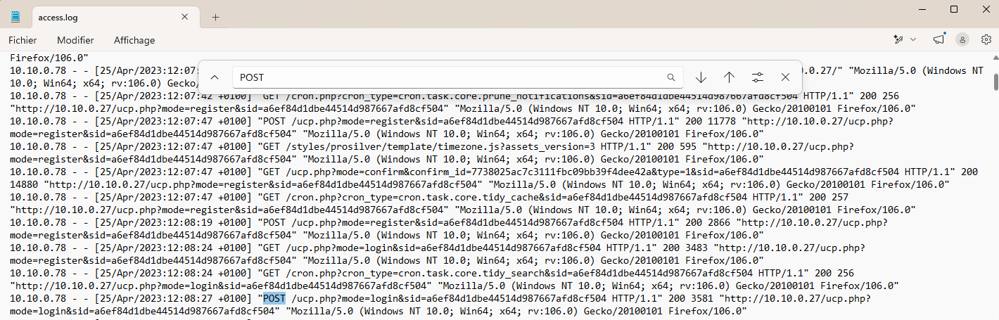

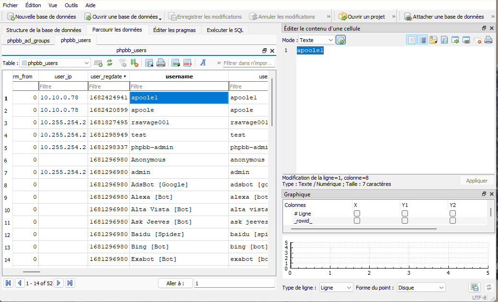

### Q2. IP utilisée pour créer le compte

La colonne `user_ip` dans `phpbb_users` contient l'adresse IP enregistrée au moment de l'inscription. DB Browser la remonte directement sur la ligne d'`apoole1`.

Confirmation côté `access.log` : un Ctrl+F sur le timestamp de création du compte (converti depuis le champ `user_regdate`) fait apparaître une requête de type register depuis 10.10.0.78 au même instant. Les deux artefacts pointent la même IP.

**Réponse** : `10.10.0.78`

C'est une IP privée du réseau guest. Le fait que ce réseau puisse joindre les services internes comme le forum est déjà une anomalie de configuration réseau, indépendamment du reste de l'incident.

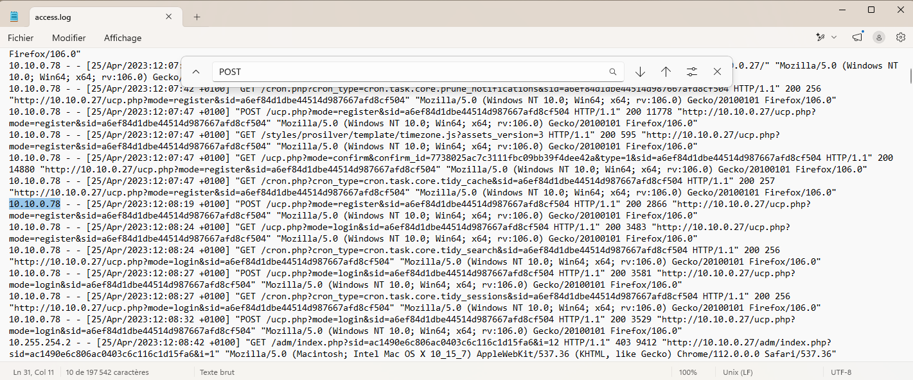

### Q3. post_id du post malveillant

On filtre les posts publiés par `apoole1` dans la table `phpbb_posts` et on examine le contenu. Un credential stealer se reconnaît à la présence de JavaScript injecté dans `post_text`, souvent avec un appel vers une URL externe.

Le post_id 9 contient un payload JavaScript qui intercepte les données de formulaire.

**Réponse** : `9`

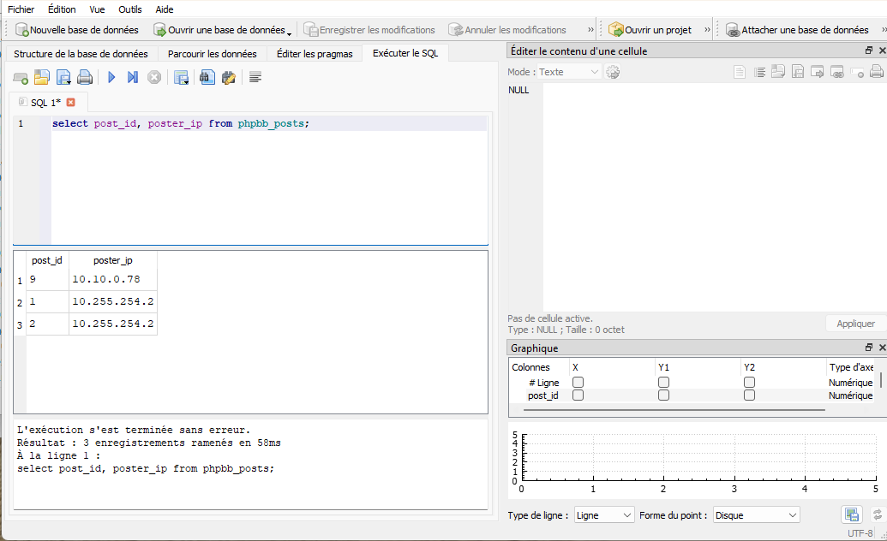

### Q4. URI cible du credential stealer

Le contenu du post_id 9 récupéré à la question précédente contient le payload complet. En lisant le JavaScript dans DB Browser ou le Bloc Notes, l'URL de destination est codée en dur dans le script et lisible directement.

Le script envoie vers `http://10.10.0.78/update.php`. C'est la même IP que l'inscription : le sous-traitant héberge son script de collecte sur sa propre machine. Une seule IP pour tout.

**Réponse** : `http://10.10.0.78/update.php`

La technique : l'admin du forum consulte le post, le script JavaScript s'exécute dans son navigateur, capture les credentials (cookies de session, identifiants de formulaire) et les envoie au serveur de l'attaquant. C'est du stored XSS détourné en credential harvester. MITRE T1056.003.

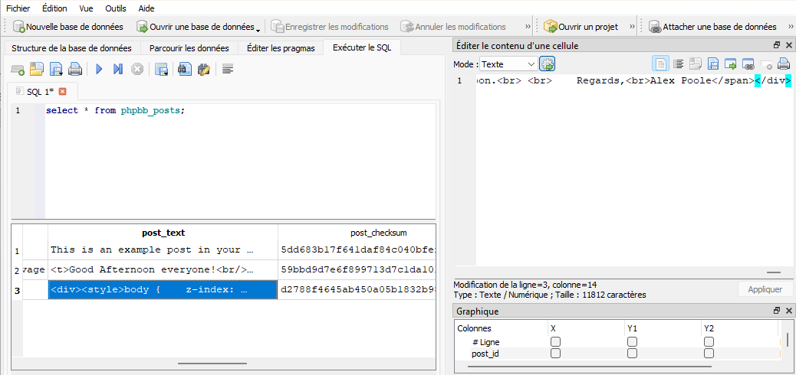

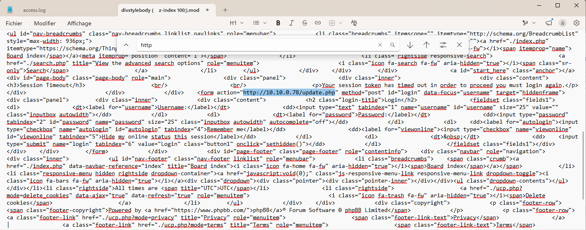

### Q5. Heure de connexion au panneau admin

L'investigation bascule sur `phpbb_log`, la table qui enregistre l'historique des actions dans le panneau d'administration. C'est un artefact persistant, contrairement à `phpbb_sessions` qui est volatile et contient uniquement l'état des sessions actives au moment de l'analyse.

On filtre sur l'opération `LOG_ADMIN_AUTH_SUCCESS`. L'entrée retourne un timestamp Unix. La conversion brute donne 11:53:12, mais les timestamps serveur ont une heure d'avance sur UTC (fuseau Europe/Paris). Il faut soustraire une heure.

**Réponse** : `26/04/2023 10:53:12`

Ce décalage UTC/heure serveur est un piège classique. La bonne méthode : identifier un événement dont on connaît l'heure précise dans les deux sources, calculer l'écart, et l'appliquer à toutes les timestamps de la même source.

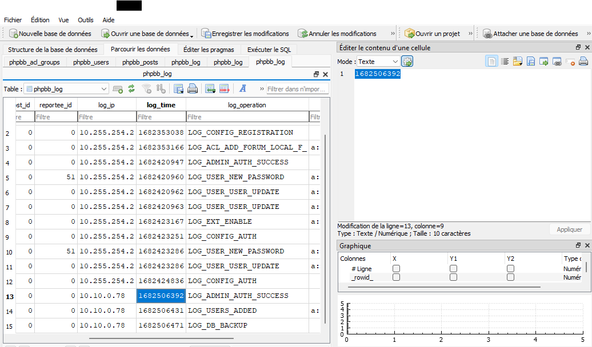

### Q6. Mot de passe LDAP en clair

La table `phpbb_config` stocke la configuration globale du forum sous forme de paires clé/valeur. Les connexions LDAP se configurent depuis le panneau admin, et les credentials se retrouvent souvent stockés là en clair. Un filtre sur les clés contenant `ldap` dans DB Browser remonte directement la clé `ldap_password`.

**Réponse** : `Passw0rd1`

Stocker des credentials d'infrastructure dans une table de configuration applicative sans chiffrement, c'est une décision qui transforme n'importe quelle compromission du forum en point d'entrée vers l'Active Directory. Si ce compte de service avait des droits de lecture sur l'annuaire, le sous-traitant peut désormais énumérer tous les utilisateurs du domaine.

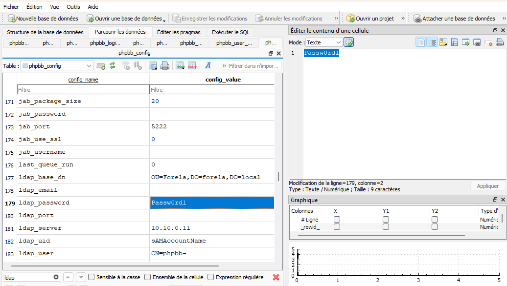

### Q7. User-Agent du compte Administrateur

Deux sources pour répondre à cette question : `phpbb_sessions` (état actuel, volatile) et les logs Apache (trace persistante de toutes les requêtes).

Dans DB Browser, la table `phpbb_sessions` contient le User-Agent associé à la session admin active. La colonne `session_browser` retourne `Mozilla/5.0 (Windows NT 10.0; Win64; x64; rv:109.0) Gecko/20100101 Firefox/112.0` qui est celui de l'acteur malveilllant.

En parallèle, un Ctrl+F sur l'IP 10.255.254.2 dans `access.log` montre `Mozilla/5.0 (Macintosh; Intel Mac OS X 10_15_7) AppleWebKit/537.36 (KHTML, like Gecko) Chrome/112.0.0.0 Safari/537.36`. C'est la signature réelle du navigateur de l'administrateur en temps normal.

**Réponse** : `Mozilla/5.0 (Macintosh; Intel Mac OS X 10_15_7) AppleWebKit/537.36 (KHTML, like Gecko) Chrome/112.0.0.0 Safari/537.36`

La discordance entre les deux sources est un IoC à part entière. En incident response, quand le User-Agent dans la base applicative ne correspond pas à celui des logs HTTP pour la même IP, ça mérite investigation. La source de vérité pour le UA réel, c'est le log Apache : il enregistre le UA que le client a effectivement envoyé dans la requête HTTP, sans que l'application puisse l'altérer.

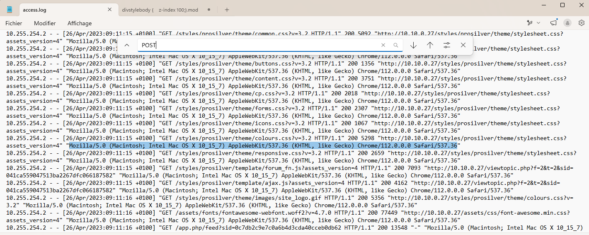

### Q8. Heure d'ajout au groupe Administrateur

Retour sur `phpbb_log`, opération `LOG_USERS_ADDED`. L'élévation de privilèges survient 39 secondes après l'authentification réussie sur le panneau admin. Même décalage UTC à appliquer : 11:53:51 heure serveur → 10:53:51 UTC.

**Réponse** : `26/04/2023 10:53:51`

39 secondes entre connexion et escalade de privilèges. L'attaquant connaissait exactement où aller dans le panneau admin.

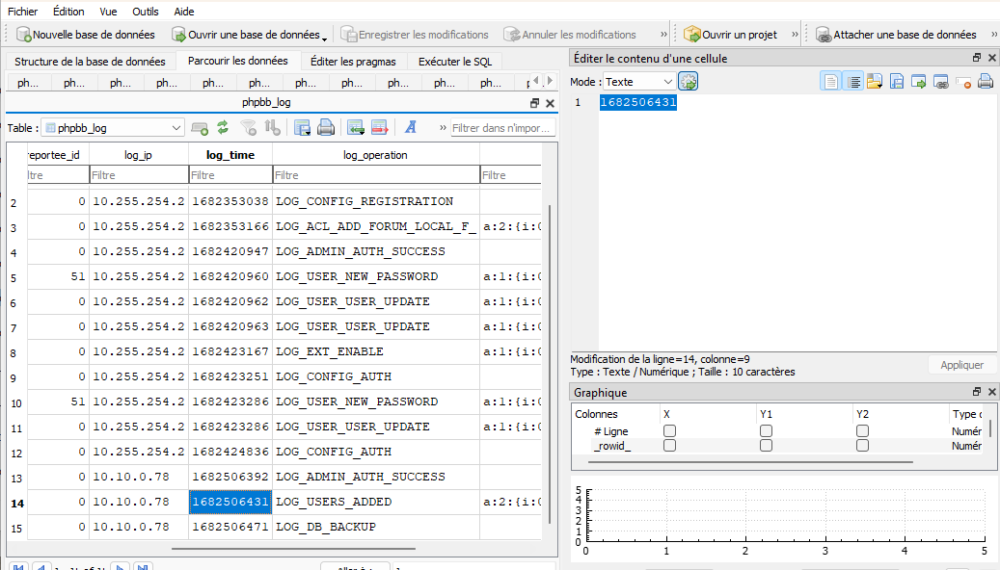

### Q9. Heure de téléchargement de la sauvegarde

Cette question se résout dans `access.log`, pas dans la base phpBB. La sauvegarde phpBB se stocke dans le répertoire `/store/` avec un nom de fichier du type `backup_[timestamp]_[hash].sql.gz`. Un Ctrl+F sur `backup` dans Notepad++ fait ressortir deux entrées.

Une requête POST vers l'interface d'administration avec `action=download` à 10:54:22 UTC (tentative via l'interface admin). Puis une requête GET directe sur le fichier statique à 11:01:38 UTC.

**Réponse** : `26/04/2023 11:01:38`

Sept minutes séparent les deux requêtes. La première tentative via l'interface a probablement buté sur une limitation, ou le sous-traitant a préféré télécharger le fichier directement en construisant le chemin `/store/backup_[timestamp].sql.gz` une fois qu'il connaissait le timestamp de la sauvegarde.

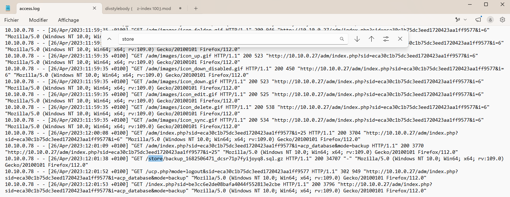

### Q10. Taille de la sauvegarde en octets

La réponse est dans la même ligne de log que Q9. Le Combined Log Format place la taille du transfert en octets juste après le code HTTP de réponse. Sur la ligne du GET `/store/backup_1682506471_...sql.gz`, le code est 200 et la taille qui suit est **34707**.

**Réponse** : `34707`

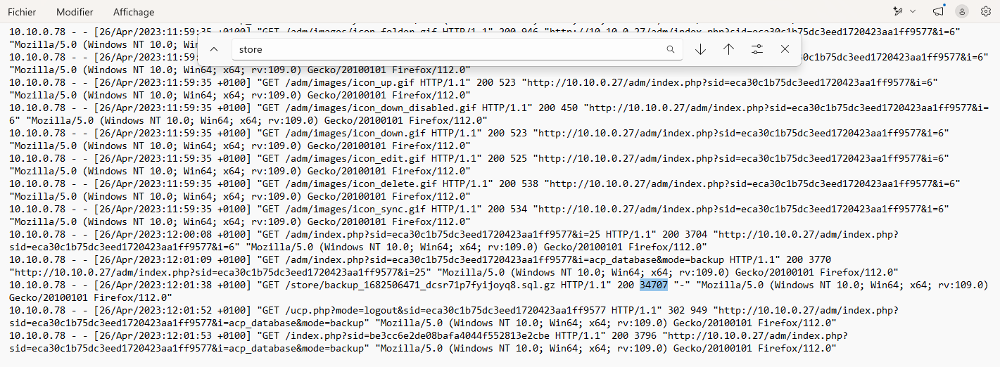

---

## Chronologie de l'incident

```
Sous-traitant s'inscrit sur le forum Forela
via le Wi-Fi guest (IP: 10.10.0.78)
       │
       ▼
Publication du post malveillant (post_id: 9)
Credential stealer JS → http://10.10.0.78/update.php
[T1056.003 — Web Portal Capture]
       │
       ▼
Admin consulte le forum
Script JS s'exécute → credentials capturés
et exfiltrés vers 10.10.0.78
[T1539 — Steal Web Session Cookie]
       │
       ▼
Connexion au panneau d'administration
26/04/2023 10:53:12 UTC
[T1078 — Valid Accounts]
       │
       ▼
Auto-ajout au groupe Administrateur
26/04/2023 10:53:51 UTC (39 secondes après)
[T1098 — Account Manipulation]
       │
       ▼
Déclenchement de la sauvegarde DB depuis l'interface admin
26/04/2023 ~10:54 UTC
[T1005 — Data from Local System]
       │
       ├──► Tentative de téléchargement via interface ACP
       │    26/04/2023 10:54:22 UTC (POST action=download)
       │
       └──► Téléchargement direct du fichier statique
            26/04/2023 11:01:38 UTC (GET /store/backup_...sql.gz)
            34707 bytes exfiltrés
            [T1041 — Exfiltration Over C2 Channel]
```

---

## Ce que j'ai retenu

La distinction entre `phpbb_log` et `phpbb_sessions` est le point technique central de ce challenge. `phpbb_sessions` contient uniquement les sessions actives au moment de l'analyse, les entrées expirent ou sont supprimées à la déconnexion. `phpbb_log`, lui, enregistre les actions administratives de façon durable. Pour reconstituer une chronologie, il faut `phpbb_log` et les logs Apache. Compter uniquement sur `phpbb_sessions` pour la forensic d'un forum phpBB, c'est travailler sur un artefact qui peut être incomplet ou vidé.

La discordance de User-Agent entre `phpbb_sessions` et les logs Apache pour la même IP confirme que les logs de l'application web et les logs du serveur HTTP ne sont pas équivalents. L'un peut mentir ou être obsolète, l'autre non. Les logs Apache sont plus difficiles à falsifier depuis l'application elle-même : le serveur web log ce qu'il reçoit, indépendamment de ce que fait phpBB ensuite.

Le décalage d'une heure entre les timestamps serveur et UTC est un piège récurrent. La méthode rapide : prendre un événement dont on connaît l'heure précise dans les deux sources, calculer l'écart, l'appliquer partout. Le fuseau est visible directement dans le format des lignes Apache (`+0100`), ce qui donne le point de référence sans ambiguïté.

`Passw0rd1` en clair dans `phpbb_config` sous la clé `ldap_password` dépasse la portée de ce challenge. La compromission du forum ne se limite pas à la base phpBB si ce compte LDAP a des droits sur l'annuaire d'entreprise. La bonne pratique : les credentials de service ne se stockent pas dans les tables de configuration applicatives, même chiffrés. Ils vont dans un gestionnaire de secrets ou dans des variables d'environnement injectées à l'exécution, hors de portée de l'application elle-même.

Le sous-traitant a utilisé la même IP (10.10.0.78) pour s'inscrire, héberger son script de collecte (`update.php`) et télécharger la sauvegarde. C'est une erreur opérationnelle qui concentre tous les IoC sur un seul hôte. Dans un vrai incident, ça simplifie le travail de l'analyste, mais ça reste un point à noter : un attaquant plus prudent aurait cloisonné ces actions sur des machines différentes.

---

## Références

- [HackTheBox Sherlock - Bumblebee](https://app.hackthebox.com/sherlocks/bumblebee)
- [phpBB Database Schema - Table List](https://wiki.phpbb.com/Table_List)
- [MITRE ATT&CK T1056.003](https://attack.mitre.org/techniques/T1056/003/) - Web Portal Capture
- [MITRE ATT&CK T1539](https://attack.mitre.org/techniques/T1539/) - Steal Web Session Cookie
- [MITRE ATT&CK T1078](https://attack.mitre.org/techniques/T1078/) - Valid Accounts
- [MITRE ATT&CK T1098](https://attack.mitre.org/techniques/T1098/) - Account Manipulation
- [MITRE ATT&CK T1005](https://attack.mitre.org/techniques/T1005/) - Data from Local System
- [DB Browser for SQLite](https://sqlitebrowser.org/)
- [Notepad++](https://notepad-plus-plus.org/)
